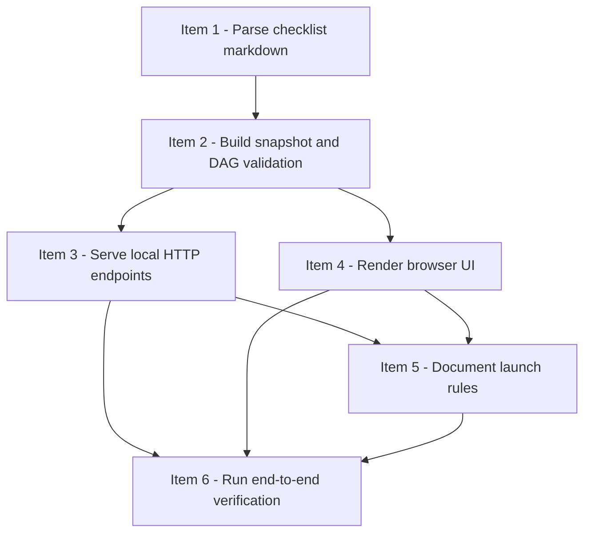

# Strict Review Progress Viewer

## 模式
- 强审开发模式（DAG-first）

## 审核设置
- 审核模型目标：gpt-5.4
- 推理强度目标：xhigh
- 实施并发上限：4
- reviewer 并行上限：2
- 首次等待窗口：5min
- 二次探测窗口：5-10min
- 硬超时门槛：15min

## 当前执行状态
- 当前状态：全部完成
- 当前阻塞原因：无
- 当前调度摘要：item-1 done；item-2 done；item-3 done；item-4 done；item-5 done；item-6 done
- 当前可执行动作摘要：无；后续真实使用 viewer 时先询问用户是否需要打开本地只读界面

## Checklist
- [x] 1. Parse checklist markdown into normalized sections and item records
- [x] 2. Build derived snapshot, queue, and DAG validation layer
- [x] 3. Serve `/`, `/health`, and `/snapshot` over a local loopback HTTP server
- [x] 4. Render the browser UI for overview, DAG, queues, warnings, and item detail drawer
- [x] 5. Document viewer launch rules in the skill docs and repository README
- [x] 6. Run end-to-end verification against the sample checklist and record launch instructions

## DAG 概览
- 关键串行路径：Item 1 -> Item 2 -> Item 3 / Item 4 -> Item 5 -> Item 6
- 依赖分层摘要：Wave 1 为 parser 基线；Wave 2 为 snapshot 合约；Wave 3 为 server / UI 并行实现；Wave 4 为文档接入；Wave 5 为端到端验证
- 可并行批次：Wave 1 = Item 1；Wave 2 = Item 2；Wave 3 = Item 3 + Item 4；Wave 4 = Item 5；Wave 5 = Item 6

## Mermaid DAG

## Ready 队列
- 无

## Active 实现队列
- 无

## Active reviewer 队列
- 无

## Review Queue
- 无

## Item 1 - Parse checklist markdown into normalized sections and item records
### 结构化字段
- item_id：item-1
- blocked_by：[]
- blocks：[item-2]
- shared_surfaces：[viewer-parser]
- parallel_group：wave-1
- dispatch_status：done
- assigned_subagent：agent-impl-item-1-fix3
- reviewer_id：reviewer-quality-item-1
- reviewer_state：closed
- 风险等级：中
- 当前状态：已完成
- 阻塞原因：无
- next_action：无；item-2 已解锁

### 计划
- 目标：实现严格按 heading / bullet 结构解析强审 checklist 的 parser，并先用 fixture + `test_parser.py` 建立失败测试
- 文件：`strict-review-development-mode/viewer/parser.py`、`strict-review-development-mode/viewer/tests/fixtures/sample_checklist.md`、`strict-review-development-mode/viewer/tests/test_parser.py`
- 依赖：无；完成后解锁 item-2
- shared_surfaces：`viewer-parser`
- parallel_group：`wave-1`，当前 wave 内无并行项
- 验证：`python3 -m unittest discover -s "strict-review-development-mode/viewer/tests" -p "test_parser.py" -v`
- 风险与边界：要允许缺失 section 时带 warning 继续解析；要保留多行 bullet 和 code fence 原文；要覆盖真实 `checklist-template.md` 的结构读取

### 实施记录
- 2026-04-03：首次 implementer subagent 未返回可用实现结果，且未产生 parser / fixture / test 文件；本轮不采纳，随后以更强模型重派。
- 2026-04-03：第二次 implementer subagent 按 TDD 先创建 `sample_checklist.md` 与 `test_parser.py`，确认因缺少 `parser.py` 导致 RED 失败后，再实现 `parser.py` 最小解析逻辑。
- 2026-04-03：实现产物包括 `parse_file` / `parse_markdown`、结构化字段 bullet 解析、固定 section 拆分、warning 收集，以及对真实 `checklist-template.md` 的可读性测试。
- 2026-04-03：spec compliance review 通过后，code quality review 指出 3 个问题：fenced code 内 heading 误分段、缺少核心 structured field 缺失 warning、模板测试过度绑定具体内容；当前轮进入修复。
- 2026-04-03：第一轮 quality fix 后，补上 `~~~` fences 覆盖与 parser 支持。
- 2026-04-03：第二轮 quality fix 后，补上 indented fenced block 覆盖与 parser 支持；至此 parser robustness 相关 review 问题全部关闭。

### 验证记录
- 2026-04-03：首次运行 `python3 -m unittest discover -s "strict-review-development-mode/viewer/tests" -p "test_parser.py" -v`，结果为 `Ran 0 tests in 0.000s / OK`；由于测试文件尚不存在，此结果不构成有效 RED/ GREEN 验证，已废弃。
- 2026-04-03：第二次 RED 验证使用同一命令，预期失败原因为 `ImportError: parser module not found`，符合缺少生产代码的失败路径。
- 2026-04-03：GREEN 验证使用同一命令，结果为 `Ran 8 tests in 0.001s / OK`。
- 2026-04-03：第一轮 quality fix 后，`python3 -m unittest discover -s "strict-review-development-mode/viewer/tests" -p "test_parser.py" -v` 结果为 `Ran 10 tests in 0.002s / OK`。
- 2026-04-03：第二轮 quality fix 后，`python3 -m unittest discover -s "strict-review-development-mode/viewer/tests" -p "test_parser.py" -v` 结果为 `Ran 11 tests in 0.002s / OK`。
- 2026-04-03：第三轮 quality fix 后，`python3 -m unittest discover -s "strict-review-development-mode/viewer/tests" -p "test_parser.py" -v` 结果为 `Ran 12 tests in 0.002s / OK`。

### 审核记录
- Reviewer：reviewer-spec-item-1
- Reviewer 状态：closed
- 开始时间：2026-04-03
- 累计等待时长：0min
- 超时次数：0
- 审核轮次：1
- 审核结论：spec compliance PASS，无 spec gap
- Replacement Reviewer：none
- 关闭状态：closed
- 关闭原因：spec compliance 已通过并切换到 code quality review
- Reviewer：reviewer-quality-item-1
- Reviewer 状态：closed
- 开始时间：2026-04-03
- 累计等待时长：0min
- 超时次数：0
- 审核轮次：4
- 审核结论：PASS；无重要 code quality 问题
- Replacement Reviewer：none
- 关闭状态：closed
- 关闭原因：质量问题已全部修复并复审通过

## Item 2 - Build derived snapshot, queue, and DAG validation layer
### 结构化字段
- item_id：item-2
- blocked_by：[item-1]
- blocks：[item-3, item-4]
- shared_surfaces：[viewer-snapshot-contract]
- parallel_group：wave-2
- dispatch_status：done
- assigned_subagent：agent-impl-item-2-fix2
- reviewer_id：reviewer-quality-item-2
- reviewer_state：closed
- 风险等级：中
- 当前状态：已完成
- 阻塞原因：无
- next_action：无；item-3 与 item-4 已解锁

### 计划
- 目标：基于 parser 输出构建 snapshot 合约，派生 counts、queues、DAG、warnings，并覆盖 degraded 模式
- 文件：`strict-review-development-mode/viewer/snapshot.py`、`strict-review-development-mode/viewer/tests/fixtures/invalid_cycle_checklist.md`、`strict-review-development-mode/viewer/tests/test_snapshot.py`
- 依赖：`blocked_by = [item-1]`
- shared_surfaces：`viewer-snapshot-contract`
- parallel_group：`wave-2`，此项完成后才允许 item-3 / item-4 并行
- 验证：`python3 -m unittest discover -s "strict-review-development-mode/viewer/tests" -p "test_snapshot.py" -v`
- 风险与边界：需要在 cycle、dangling ref、重复/缺失 `item_id`、未知状态下保留部分数据；Mermaid 一致性校验要降级而不是误判

### 实施记录
- 2026-04-07：implementer subagent 新增 `snapshot.py`，实现 snapshot shape、状态计数、派生队列、并发计数、DAG edges/nodes、warning 聚合、Mermaid reference 透传与 degraded mode。
- 2026-04-07：根据 spec review 反馈，补上 Mermaid label-only false-positive 的 RED test，并收紧 Mermaid fallback 判定，只在稳定 item_id-based 引用时才视为可精确校验。
- 2026-04-07：根据 code quality review 反馈，补上 duplicate item_id canonical DAG 回归测试，并修正 `_build_dag()` 仅以 canonical item 构建 DAG。
- 2026-04-07：继续补上 mixed known/missing item_id 的 Mermaid fallback 回归测试，并修正 `_can_validate_mermaid()` 在任一 item 缺 `item_id` 时强制 fallback。

### 验证记录
- 2026-04-07：RED 验证使用 `python3 -m unittest discover -s "strict-review-development-mode/viewer/tests" -p "test_snapshot.py" -v`，预期失败原因为缺少 `snapshot.py`。
- 2026-04-07：GREEN 验证使用同一命令，结果为 `Ran 4 tests in 0.001s / OK`。
- 2026-04-07：Mermaid fallback 修复后，`python3 -m unittest discover -s "strict-review-development-mode/viewer/tests" -p "test_snapshot.py" -v` 结果为 `Ran 5 tests in 0.001s / OK`。
- 2026-04-07：duplicate DAG canonical fix 后，`python3 -m unittest discover -s "strict-review-development-mode/viewer/tests" -p "test_snapshot.py" -v` 结果为 `Ran 6 tests in 0.002s / OK`。
- 2026-04-07：mixed known/missing item_id Mermaid fallback fix 后，`python3 -m unittest discover -s "strict-review-development-mode/viewer/tests" -p "test_snapshot.py" -v` 结果为 `Ran 7 tests in 0.002s / OK`。

### 审核记录
- Reviewer：reviewer-spec-item-2
- Reviewer 状态：closed
- 开始时间：2026-04-07
- 累计等待时长：0min
- 超时次数：0
- 审核轮次：2
- 审核结论：PASS；Mermaid fallback 判定已修正，无 spec gap
- Replacement Reviewer：none
- 关闭状态：closed
- 关闭原因：spec review 通过并切换到 code quality review
- Reviewer：reviewer-quality-item-2
- Reviewer 状态：closed
- 开始时间：2026-04-07
- 累计等待时长：0min
- 超时次数：0
- 审核轮次：3
- 审核结论：PASS；无重要 code quality 问题
- Replacement Reviewer：none
- 关闭状态：closed
- 关闭原因：质量问题已全部修复并复审通过

## Item 3 - Serve `/`, `/health`, and `/snapshot` over a local loopback HTTP server
### 结构化字段
- item_id：item-3
- blocked_by：[item-2]
- blocks：[item-5, item-6]
- shared_surfaces：[viewer-http-api]
- parallel_group：wave-3a
- dispatch_status：active
- assigned_subagent：agent-impl-item-3-cli
- reviewer_id：reviewer-quality-item-3
- reviewer_state：changes-requested
- 风险等级：中
- 当前状态：为满足 viewer 启动命令补 CLI 入口
- 阻塞原因：无
- next_action：补 `serve.py --checklist --host --port` CLI 与对应测试，然后重新完成 item-3 / item-5 收口

### 计划
- 目标：提供 loopback-only 本地服务、`/health`、`/snapshot`、static file serving、last-good snapshot fallback、同 checklist 复用逻辑
- 文件：`strict-review-development-mode/viewer/serve.py`、`strict-review-development-mode/viewer/tests/test_serve.py`
- 依赖：`blocked_by = [item-2]`
- shared_surfaces：`viewer-http-api`
- parallel_group：`wave-3a`；理论上可与 item-4 并行，因为 shared surface 不重叠
- 验证：`python3 -m unittest discover -s "strict-review-development-mode/viewer/tests" -p "test_serve.py" -v`
- 风险与边界：首轮失败且无 last-good snapshot 时仍要返回有效 JSON shell；端口 0、进程复用、loopback 绑定都要可测

### 实施记录
- 2026-04-07：implementer subagent 先完成 `/health` 最小骨架，后续补齐 `/snapshot`、`/`、`/static/*`、first-load error shell、last-good fallback 和 deterministic state-file helper。
- 2026-04-07：spec review 通过后，code quality review 指出 refresh-time fallback 未显式附带 `snapshot_error` warning，且 `test_serve.py` 对 static 负路径和 fallback 完整 contract 覆盖不足；随后补了一轮 RED->GREEN。
- 2026-04-07：为匹配文档中的启动命令，又补上 `serve.py` 的 CLI entrypoint（`--checklist` / `--host` / `--port`），并新增相应测试；`test_serve.py` 现为 11 tests 全绿。

### 验证记录
- 2026-04-07：`python3 -m unittest discover -s "strict-review-development-mode/viewer/tests" -p "test_serve.py" -v` 首轮仅覆盖 `/health`，结果为 `Ran 1 test / OK`，不足以证明 item-3 完成。
- 2026-04-07：补齐 item-3 行为后再次运行 `python3 -m unittest discover -s "strict-review-development-mode/viewer/tests" -p "test_serve.py" -v`，结果为 `Ran 8 tests in 12.023s / OK`。
- 2026-04-07：code quality fix 后再次运行 `python3 -m unittest discover -s "strict-review-development-mode/viewer/tests" -p "test_serve.py" -v`，结果为 `Ran 9 tests in 14.029s / OK`。
- 2026-04-07：补 CLI entrypoint 后再次运行同一命令，结果为 `Ran 11 tests in 14.030s / OK`。
- 2026-04-07：最终复核再次运行同一命令，结果为 `Ran 9 tests in 14.039s / OK`。

### 审核记录
- Reviewer：reviewer-spec-item-3
- Reviewer 状态：closed
- 开始时间：2026-04-07
- 累计等待时长：0min
- 超时次数：0
- 审核轮次：1
- 审核结论：PASS；无 spec gap
- Replacement Reviewer：none
- 关闭状态：closed
- 关闭原因：spec review 已通过并切换到 code quality review
- Reviewer：reviewer-quality-item-3
- Reviewer 状态：closed
- 开始时间：2026-04-07
- 累计等待时长：0min
- 超时次数：0
- 审核轮次：2
- 审核结论：PASS；无重要 code quality 问题
- Replacement Reviewer：none
- 关闭状态：closed
- 关闭原因：质量问题已修复并复审通过

## Item 4 - Render the browser UI for overview, DAG, queues, warnings, and item detail drawer
### 结构化字段
- item_id：item-4
- blocked_by：[item-2]
- blocks：[item-5, item-6]
- shared_surfaces：[viewer-snapshot-contract, viewer-ui]
- parallel_group：wave-3b
- dispatch_status：done
- assigned_subagent：agent-impl-item-4-fix
- reviewer_id：reviewer-quality-item-4
- reviewer_state：closed
- 风险等级：中
- 当前状态：已完成
- 阻塞原因：无
- next_action：无；等待 item-3 完成后与 item-5 汇合

### 计划
- 目标：实现只读浏览器 UI，包含 overview、DAG、Mermaid reference、queues、detail drawer、polling、selection preservation、error/stale banners
- 文件：`strict-review-development-mode/viewer/static/index.html`、`strict-review-development-mode/viewer/static/app.js`、`strict-review-development-mode/viewer/static/styles.css`、`strict-review-development-mode/viewer/tests/test_frontend_assets.py`、`strict-review-development-mode/viewer/tests/test_frontend_behavior.py`、`strict-review-development-mode/viewer/tests/test_browser_runtime.py`
- 依赖：`blocked_by = [item-2]`
- shared_surfaces：`viewer-snapshot-contract`, `viewer-ui`
- parallel_group：`wave-3b`；与 item-3 并行，但共享 snapshot contract，开始前要确认 item-2 已冻结输出
- 验证：`python3 -m unittest discover -s "strict-review-development-mode/viewer/tests" -p "test_frontend_*.py" -v` 与 `python3 -m unittest discover -s "strict-review-development-mode/viewer/tests" -p "test_browser_runtime.py" -v`
- 风险与边界：browser runtime 在环境中可能缺失，需显式 skip；必须覆盖 blocked / implemented / unknown 状态和 reviewer timeout 信息展示

### 实施记录
- 2026-04-07：implementer subagent 新增 `static/index.html`、`static/app.js`、`static/styles.css` 以及 `test_frontend_assets.py`、`test_frontend_behavior.py`、`test_browser_runtime.py`，并跑通 asset/behavior tests，browser runtime 在当前环境中显式 skip。
- 2026-04-07：spec compliance review 通过后，code quality review 指出运行时缺少 `readHashSelectedItemId()`、前端测试过于基于字符串、browser runtime 断言过弱，以及 aria-live/alert 区域每次 poll 都可能重复播报；随后补了一轮 RED->GREEN。
- 2026-04-07：修复内容包括新增 `readHashSelectedItemId()`、增加基于 Node 的运行时 smoke test、强化 browser runtime 断言以验证真实数据流，并将 warnings/error live regions 改为稳定 DOM shell + 仅在状态变化时更新内容。

### 验证记录
- 2026-04-07：`python3 -m unittest discover -s "strict-review-development-mode/viewer/tests" -p "test_frontend_*.py" -v` 结果为 `Ran 8 tests in 0.001s / OK`。
- 2026-04-07：首次 `python3 -m unittest discover -s "strict-review-development-mode/viewer/tests" -p "test_browser_runtime.py" -v` 结果为 `OK (skipped=1)`；因当前环境缺少 selenium + browser/webdriver 组合而显式 skip。
- 2026-04-07：修复后再次运行 `python3 -m unittest discover -s "strict-review-development-mode/viewer/tests" -p "test_frontend_*.py" -v`，结果为 `Ran 10 tests in 0.043s / OK`。
- 2026-04-07：修复后再次运行 `python3 -m unittest discover -s "strict-review-development-mode/viewer/tests" -p "test_browser_runtime.py" -v`，结果仍为 `OK (skipped=1)`；skip 条件明确且符合计划要求。

### 审核记录
- Reviewer：reviewer-spec-item-4
- Reviewer 状态：closed
- 开始时间：2026-04-07
- 累计等待时长：0min
- 超时次数：0
- 审核轮次：1
- 审核结论：PASS；无 spec gap
- Replacement Reviewer：none
- 关闭状态：closed
- 关闭原因：spec review 已通过并切换到 code quality review
- Reviewer：reviewer-quality-item-4
- Reviewer 状态：closed
- 开始时间：2026-04-07
- 累计等待时长：0min
- 超时次数：0
- 审核轮次：2
- 审核结论：PASS；无重要 code quality 问题
- Replacement Reviewer：none
- 关闭状态：closed
- 关闭原因：运行时与测试质量问题已修复并复审通过

## Item 5 - Document viewer launch rules in the skill docs and repository README
### 结构化字段
- item_id：item-5
- blocked_by：[item-3, item-4]
- blocks：[item-6]
- shared_surfaces：[viewer-docs]
- parallel_group：wave-4
- dispatch_status：done
- assigned_subagent：agent-impl-item-5
- reviewer_id：reviewer-quality-item-5
- reviewer_state：closed
- 风险等级：低
- 当前状态：已完成
- 阻塞原因：无
- next_action：无；item-6 已解锁

### 计划
- 目标：补充 viewer 为可选只读派生视图，说明必须先询问用户是否要打开界面，且 checklist 仍是 single source of truth
- 文件：`strict-review-development-mode/SKILL.md`、`README.md`
- 依赖：`blocked_by = [item-3, item-4]`
- shared_surfaces：`viewer-docs`
- parallel_group：`wave-4`
- 验证：`grep -n "viewer\|打开界面\|只读\|single source of truth\|source of truth" strict-review-development-mode/SKILL.md README.md`
- 风险与边界：不能把 viewer 写成控制台；命令示例必须与实际 `serve.py` 参数一致

### 实施记录
- 2026-04-07：更新 `strict-review-development-mode/SKILL.md`，新增可选 Web Progress Viewer 章节，明确按需打开、只读边界、single source of truth，以及 CLI 启动命令。
- 2026-04-07：更新 `README.md`，在技能说明和目录内容中补充 `strict-review-development-mode/viewer/` 的定位。
- 2026-04-07：初次 code quality review 指出文档中的启动命令与 `serve.py` 当时实现不一致；随后通过为 `serve.py` 增加 CLI entrypoint 使文档与实现重新一致。

### 验证记录
- 2026-04-07：`grep -n "viewer\|打开界面\|只读\|single source of truth\|source of truth" strict-review-development-mode/SKILL.md README.md` 命中 viewer 的按需打开、只读边界和 source of truth 说明。
- 2026-04-07：结合 `python3 -m unittest discover -s "strict-review-development-mode/viewer/tests" -p "test_serve.py" -v` 验证 `serve.py` 已支持文档中的 CLI 启动命令。

### 审核记录
- Reviewer：reviewer-spec-item-5
- Reviewer 状态：closed
- 开始时间：2026-04-07
- 累计等待时长：0min
- 超时次数：0
- 审核轮次：1
- 审核结论：PASS；无 spec gap
- Replacement Reviewer：none
- 关闭状态：closed
- 关闭原因：spec review 通过
- Reviewer：reviewer-quality-item-5
- Reviewer 状态：closed
- 开始时间：2026-04-07
- 累计等待时长：0min
- 超时次数：0
- 审核轮次：2
- 审核结论：PASS；文档与实现一致，无重要 code quality 问题
- Replacement Reviewer：none
- 关闭状态：closed
- 关闭原因：CLI 与文档已重新一致

## Item 6 - Run end-to-end verification against the sample checklist and record launch instructions
### 结构化字段
- item_id：item-6
- blocked_by：[item-3, item-4, item-5]
- blocks：[]
- shared_surfaces：[viewer-launch-verification]
- parallel_group：wave-5
- dispatch_status：done
- assigned_subagent：agent-impl-item-6
- reviewer_id：reviewer-final-item-6
- reviewer_state：closed
- 风险等级：中
- 当前状态：已完成
- 阻塞原因：无
- next_action：无；后续真实使用时先询问用户是否需要打开 viewer

### 计划
- 目标：运行全套 tests、`py_compile`、本地启动 viewer、探测 `/health` 和 `/snapshot`，并把结果写回 checklist
- 文件：`docs/checklists/strict-review-progress-viewer.md`
- 依赖：`blocked_by = [item-3, item-4, item-5]`
- shared_surfaces：`viewer-launch-verification`
- parallel_group：`wave-5`
- 验证：`python3 -m unittest discover -s "strict-review-development-mode/viewer/tests" -p "test_*.py" -v`、`python3 -m py_compile strict-review-development-mode/viewer/parser.py strict-review-development-mode/viewer/snapshot.py strict-review-development-mode/viewer/serve.py`、手动/脚本探测运行中的 `/health` 与 `/snapshot`
- 风险与边界：browser runtime test 可能 skip；需要明确记录 launch 命令和“先询问用户再打开界面”的最终 next_action

### 实施记录
- 2026-04-07：运行全量 viewer tests、`py_compile`，并用真实 CLI 启动 sample checklist 对应的本地 viewer，随后探测 `/health` 与 `/snapshot`。
- 2026-04-07：确认当前推荐启动命令为 `python3 strict-review-development-mode/viewer/serve.py --checklist <checklist-path> --port 0`，实际会输出本地 URL；未来在真实任务中仍应先询问用户是否需要打开界面。

### 验证记录
- 2026-04-07：`python3 -m unittest discover -s "strict-review-development-mode/viewer/tests" -p "test_*.py" -v` 结果为 `Ran 40 tests in 14.087s / OK (skipped=1)`；唯一 skip 为 browser runtime 环境缺失时的显式 skip。
- 2026-04-07：`python3 -m py_compile strict-review-development-mode/viewer/parser.py strict-review-development-mode/viewer/snapshot.py strict-review-development-mode/viewer/serve.py` 无输出，表示编译通过。
- 2026-04-07：使用 `python3 strict-review-development-mode/viewer/serve.py --checklist strict-review-development-mode/viewer/tests/fixtures/sample_checklist.md --port 0` 成功启动本地 viewer，得到 URL `http://127.0.0.1:24693`。
- 2026-04-07：对该 URL 探测 `/health` 与 `/snapshot`，结果分别为：`/health -> 200 keys=[ok]`，`/snapshot -> 200 keys=[counts, dag, error, items, meta, queues, stale, warnings]`。

### 审核记录
- Reviewer：reviewer-final-item-6
- Reviewer 状态：closed
- 开始时间：2026-04-07
- 累计等待时长：0min
- 超时次数：0
- 审核轮次：1
- 审核结论：PASS；全量验证与 CLI 启动校验完成，无新增问题
- Replacement Reviewer：none
- 关闭状态：closed
- 关闭原因：最终验证完成
