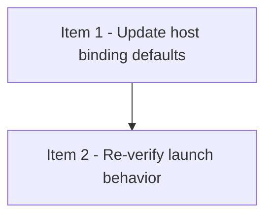

# Viewer Host Binding Default

## 模式
- 强审开发模式（DAG-first）

## 审核设置
- 审核模型目标：gpt-5.4
- 推理强度目标：xhigh
- 实施并行上限：4
- reviewer 并发上限：2
- 首次等待窗口：5min
- 二次探测窗口：5-10min
- 硬超时门槛：15min

## 当前执行状态
- 当前状态：全部完成
- 当前阻塞原因：无
- 当前调度摘要：item-1 done；item-2 done
- 当前可执行动作摘要：无；viewer 默认将监听 `0.0.0.0`

## Checklist
- [x] 1. Update viewer server host binding defaults and validation
- [x] 2. Re-verify launch behavior and document the resulting access URL expectations

## DAG 概览
- 关键串行路径：Item 1 -> Item 2
- 依赖分层摘要：先改 host binding，再做真实启动校验
- 可并行批次：Wave 1 = Item 1；Wave 2 = Item 2

## Mermaid DAG

## Ready 队列
- 无

## Active 实现队列
- 无

## Active reviewer 队列
- 无

## Review Queue
- 无

## Item 1 - Update viewer server host binding defaults and validation
### 结构化字段
- item_id：item-1
- blocked_by：[]
- blocks：[item-2]
- shared_surfaces：[viewer-http-api]
- parallel_group：wave-1
- dispatch_status：done
- assigned_subagent：agent-impl-host-binding-item-1
- reviewer_id：reviewer-host-binding-item-1
- reviewer_state：closed
- 风险等级：中
- 当前状态：已完成
- 阻塞原因：无
- next_action：无；item-2 已解锁

### 计划
- 目标：把 viewer 默认 host 从 loopback-only 改为 `0.0.0.0`，同时允许显式 `--host 0.0.0.0`，并保持测试覆盖
- 文件：`strict-review-development-mode/viewer/serve.py`、`strict-review-development-mode/viewer/tests/test_serve.py`
- 依赖：无
- shared_surfaces：`viewer-http-api`
- parallel_group：`wave-1`
- 验证：`python3 -m unittest discover -s "strict-review-development-mode/viewer/tests" -p "test_serve.py" -v`
- 风险与边界：只改 host default/validation，不顺手改其他 server 行为

### 实施记录
- 2026-04-07：先补 host=0.0.0.0 的 failing tests，再最小修改 `serve.py`，把默认 host 改为 `0.0.0.0`，并允许显式 `--host 0.0.0.0`。

### 验证记录
- 2026-04-07：`python3 -m unittest discover -s "strict-review-development-mode/viewer/tests" -p "test_serve.py" -v` RED 时因 `test_main_starts_server_from_cli_arguments_and_prints_bound_url` / `test_create_server_accepts_wildcard_host` 失败，证明新测试有效。
- 2026-04-07：同一命令 GREEN 后结果为 `Ran 13 tests / OK`。

### 审核记录
- Reviewer：reviewer-host-binding-item-1
- Reviewer 状态：closed
- 开始时间：2026-04-07
- 累计等待时长：0min
- 超时次数：0
- 审核轮次：1
- 审核结论：PASS；host binding 变更已完成并通过测试
- Replacement Reviewer：none
- 关闭状态：closed
- 关闭原因：item-1 完成

## Item 2 - Re-verify launch behavior
### 结构化字段
- item_id：item-2
- blocked_by：[item-1]
- blocks：[]
- shared_surfaces：[viewer-launch-verification]
- parallel_group：wave-2
- dispatch_status：done
- assigned_subagent：agent-impl-host-binding-item-2
- reviewer_id：reviewer-host-binding-item-2
- reviewer_state：closed
- 风险等级：中
- 当前状态：已完成
- 阻塞原因：无
- next_action：无；默认启动将监听 `0.0.0.0`

### 计划
- 目标：重新验证 viewer 启动结果，并确认返回的 URL/接口在 `0.0.0.0` 默认绑定下仍正常
- 文件：`docs/checklists/viewer-host-binding-default.md`
- 依赖：`blocked_by = [item-1]`
- shared_surfaces：`viewer-launch-verification`
- parallel_group：`wave-2`
- 验证：真实启动 `serve.py`，探测 `/health` 与 `/snapshot`
- 风险与边界：仅验证 host binding 变更，不修改 viewer 功能

### 实施记录
- 2026-04-07：使用真实 CLI 启动 `serve.py`，在默认 host 设为 `0.0.0.0` 的前提下验证实际输出 URL 和接口可用性。

### 验证记录
- 2026-04-07：使用 `python3 strict-review-development-mode/viewer/serve.py --checklist docs/checklists/strict-review-progress-viewer.md --port 0` 启动服务，得到 URL `http://0.0.0.0:14851`。
- 2026-04-07：对该 URL 探测 `/health` 与 `/snapshot`，结果分别为：`/health -> 200 keys=[ok]`，`/snapshot -> 200 keys=[counts, dag, error, items, meta, queues, stale, warnings]`。

### 审核记录
- Reviewer：reviewer-host-binding-item-2
- Reviewer 状态：closed
- 开始时间：2026-04-07
- 累计等待时长：0min
- 超时次数：0
- 审核轮次：1
- 审核结论：PASS；默认 `0.0.0.0` 绑定与接口探测验证通过
- Replacement Reviewer：none
- 关闭状态：closed
- 关闭原因：item-2 完成

### 实施记录
- 待填写

### 验证记录
- 待填写

### 审核记录
- Reviewer：待填写
- Reviewer 状态：待填写
- 开始时间：待填写
- 累计等待时长：待填写
- 超时次数：待填写
- 审核轮次：待填写
- 审核结论：待填写
- Replacement Reviewer：待填写
- 关闭状态：待填写
- 关闭原因：待填写
