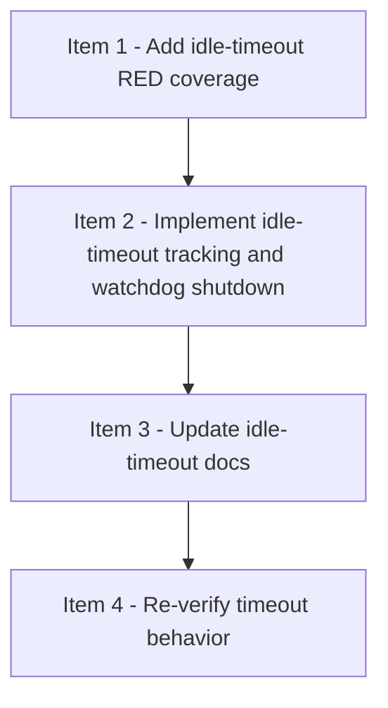

# Viewer Idle Timeout

## 模式
- 强审开发模式（DAG-first）

## 审核设置
- 审核模型目标：gpt-5.4
- 推理强度目标：xhigh
- 实施并行上限：4
- reviewer 并发上限：2
- 首次等待窗口：5min
- 二次探测窗口：5-10min
- 硬超时门槛：15min

## 当前执行状态
- 当前状态：全部完成
- 当前阻塞原因：无
- 当前调度摘要：item-1 / item-2 / item-3 / item-4 done
- 当前可执行动作摘要：无

## Checklist
- [x] 1. Add idle-timeout RED coverage
- [x] 2. Implement idle-timeout tracking and watchdog shutdown
- [x] 3. Update idle-timeout docs
- [x] 4. Re-verify timeout behavior

## DAG 概览
- 关键串行路径：Item 1 -> Item 2 -> Item 3 -> Item 4
- 依赖分层摘要：Wave 1 先补 RED 覆盖；Wave 2 实现 idle-timeout tracking / watchdog shutdown；Wave 3 更新 docs；Wave 4 再验证 timeout 行为；当前 item-4 已完成验证并进入 in-review，等待 reviewer-timeout-item-4 结论
- 可并行批次：Wave 1 = Item 1；Wave 2 = Item 2；Wave 3 = Item 3；Wave 4 = Item 4

## Mermaid DAG

## Ready 队列
- 无

## Active 实现队列
- 无

## Active reviewer 队列
- 无

## Review Queue
- 无

## Item 1 - Add idle-timeout RED coverage
### 结构化字段
- item_id：item-1
- blocked_by：[]
- blocks：[item-2]
- shared_surfaces：[viewer-test-contract]
- parallel_group：wave-1
- dispatch_status：done
- assigned_subagent：agent-impl-timeout-item-1
- reviewer_id：reviewer-timeout-item-1
- reviewer_state：closed
- 当前状态：RED 测试与 harness 质量修复已审核通过
- 阻塞原因：无
- next_action：无；item-2 已解锁

### 计划
- 目标：先补 idle timeout / keepalive（页面服务请求，如 `/` / `/static/*`，不含 `/health`） / watchdog 的 failing tests，锁住默认 30 分钟超时、活动路径判定、CLI 默认行为和 watchdog 终止语义
- 文件：`strict-review-development-mode/viewer/tests/test_serve.py`
- 依赖：无
- shared_surfaces：`viewer-test-contract`
- parallel_group：`wave-1`
- 验证：`python3 -m unittest discover -s "strict-review-development-mode/viewer/tests" -p "test_serve.py" -v`
- 风险与边界：只写 RED 断言，不改生产实现

### 实施记录
- 2026-04-07：在 `strict-review-development-mode/viewer/tests/test_serve.py` 新增 `ServeViewerIdleTimeoutTests`，补充 `create_server(... idle_timeout_seconds=1.5, watchdog_interval_seconds=0.1)` 配置缝、默认 30 分钟 timeout / 正 watchdog interval、`is_activity_path()` 对 `/`、`/snapshot`、`/static/app.js`、`/app.js` 与 `/health` 的分类断言。
- 2026-04-07：同一测试类补充短超时 watchdog 行为 RED 覆盖：无活动自动退出、重复 `/snapshot` 续命、重复 `/health` 不续命、`/static/app.js` 与 `/app.js` 刷新活动时间，以及单次 watchdog 内部异常后后续 clean check 仍只触发一次 shutdown 的确定性测试。
- 2026-04-07：保持 CLI 用户可见命令形态不变，仅通过 `parse_args(["--checklist", ...])` + 默认 `create_server(...)` 断言默认 idle-timeout 行为，不改 `serve.py` 生产代码。
- 2026-04-07：根据 reviewer-timeout-item-1 round 1 的 code quality review，修正两个 server helper 的 `addCleanup()` 注册顺序，确保 LIFO 清理时先 `server.shutdown()`、再 `server.server_close()`、最后 `thread.join()`；同时为所有 `urllib.request.urlopen(...)` helper 调用补上显式 `timeout=1.0`，避免未来 hang 住测试进程。

### 验证记录
- 2026-04-07：`python3 -m unittest discover -s "strict-review-development-mode/viewer/tests" -p "test_serve.py" -v` RED；失败集中在 idle-timeout/watchdog 缺口：`create_server()` 不接受 `idle_timeout_seconds` / `watchdog_interval_seconds`，`ViewerServer` 缺少 `idle_timeout_seconds` 属性，缺少 `is_activity_path()`，以及 `_watchdog_check_once()` / 自动退出语义尚不存在。
- 2026-04-07：在仅修正测试 harness cleanup-order / HTTP timeout 后再次运行 `python3 -m unittest discover -s "strict-review-development-mode/viewer/tests" -p "test_serve.py" -v`；suite 仍保持 RED，失败原因仍集中在 idle-timeout 生产能力缺口，未再暴露 cleanup 顺序或缺省 HTTP timeout 引发的新挂死问题。

### 审核记录
- Reviewer：reviewer-timeout-item-1
- Reviewer 状态：closed
- 开始时间：2026-04-07
- 累计等待时长：0min
- 超时次数：0
- 审核轮次：2
- 审核结论：PASS；item-1 的 RED 覆盖、cleanup-order 修复与显式 HTTP timeout 已通过复审，可解锁 item-2
- Replacement Reviewer：none
- 关闭状态：closed
- 关闭原因：item-1 完成

## Item 2 - Implement idle-timeout tracking and watchdog shutdown
### 结构化字段
- item_id：item-2
- blocked_by：[item-1]
- blocks：[item-3]
- shared_surfaces：[viewer-http-api, viewer-runtime-lifecycle]
- parallel_group：wave-2
- dispatch_status：done
- assigned_subagent：agent-impl-timeout-item-2
- reviewer_id：reviewer-timeout-item-2
- reviewer_state：closed

### 计划
- 目标：在 `serve.py` 中添加 last activity 状态、activity-path 分类、watchdog 线程、一次性 shutdown 保护和请求前刷新行为，保持 CLI 形态不变；若 idle 触发的 `shutdown()` 发生瞬时异常，必须允许后续 clean tick 重新尝试，避免 one-shot latch 永久吞掉 auto-exit
- 文件：`strict-review-development-mode/viewer/serve.py`
- 依赖：`blocked_by = [item-1]`
- shared_surfaces：`viewer-http-api`、`viewer-runtime-lifecycle`
- parallel_group：`wave-2`
- 验证：`python3 -m unittest discover -s "strict-review-development-mode/viewer/tests" -p "test_serve.py" -v`
- 风险与边界：不新增用户可见 CLI flags；watchdog 只负责 shutdown 一次，`main()` 继续负责 `server_close()`

### 实施记录
- 2026-04-07：编辑 `strict-review-development-mode/viewer/serve.py`；结果：为 `ViewerServer` / `create_server(...)` 加入默认内部 timeout 配置（`idle_timeout_seconds=1800.0`、`watchdog_interval_seconds=5.0`），新增 `last_activity_monotonic` 状态、`mark_activity()`、`seconds_since_last_activity()`、模块级 `is_activity_path()`，并在 `do_GET()` 中于 `/`、`/snapshot`、`/static/*` 与 root-level asset alias 请求前刷新活动时间，同时排除 `/health`。
- 2026-04-07：继续编辑 `strict-review-development-mode/viewer/serve.py`；结果：新增 `_start_watchdog()`、`_watchdog_check_once()`、`_shutdown_for_idle()` 与后台 watchdog loop，接线到 `serve_forever()` / `shutdown()`，保证 watchdog 只拥有 `shutdown()`、具备一次性 idle shutdown 保护、单次 tick 异常后后续检查仍可继续，并把 `serve_forever()` 的实际 poll interval 收紧到不大于 watchdog interval 以满足短超时退出语义。
- 2026-04-07：根据 round-1 code-quality feedback，在 `strict-review-development-mode/viewer/tests/test_serve.py` 先新增 `test_watchdog_retries_idle_shutdown_after_transient_shutdown_error()` 作为最小回归测试，证明首次 idle-triggered `shutdown()` 抛错后，后续 clean tick 仍会再次尝试并仅成功 shutdown 一次；随后对 `strict-review-development-mode/viewer/serve.py` 做最小修复：仅在 `_shutdown_for_idle()` 的 `shutdown()` 真正成功后保留 one-shot latch，若 `shutdown()` 抛错则在异常路径内回滚 `_idle_shutdown_started`，允许后续 watchdog tick 重试。

### 验证记录
- 2026-04-07：`python3 -m unittest discover -s "strict-review-development-mode/viewer/tests" -p "test_serve.py" -v`；结果：`Ran 22 tests in 6.457s / OK`，item-2 所需的 idle-timeout / watchdog serve suite 全绿。
- 2026-04-07：先运行 `python3 "strict-review-development-mode/viewer/tests/test_serve.py" -v ServeViewerIdleTimeoutTests.test_watchdog_retries_idle_shutdown_after_transient_shutdown_error`；结果：RED，断言第二次 `_watchdog_check_once()` 应重试 idle shutdown 但实际返回 `False`，复现 reviewer 指出的 one-shot latch 提前锁死问题。
- 2026-04-07：修复后重新运行 `python3 "strict-review-development-mode/viewer/tests/test_serve.py" -v ServeViewerIdleTimeoutTests.test_watchdog_retries_idle_shutdown_after_transient_shutdown_error`；结果：GREEN，回归测试通过，证明瞬时 `shutdown()` 异常不会永久禁用后续 idle auto-exit 重试。
- 2026-04-07：运行 `python3 -m unittest discover -s "strict-review-development-mode/viewer/tests" -p "test_serve.py" -v`；结果：`Ran 23 tests in 6.510s / OK`，新增回归测试后全量 serve suite 仍全绿。

### 审核记录
- Reviewer：reviewer-timeout-item-2
- Reviewer 状态：closed
- 开始时间：2026-04-07
- 累计等待时长：0min
- 超时次数：0
- 审核轮次：2
- 审核结论：PASS；idle-timeout / watchdog 实现通过复审，transient shutdown failure 回归已覆盖，item-3 与 item-4 bookkeeping 已澄清
- Replacement Reviewer：none
- 关闭状态：closed
- 关闭原因：item-2 完成

## Item 3 - Update idle-timeout docs
### 结构化字段
- item_id：item-3
- blocked_by：[item-2]
- blocks：[item-4]
- shared_surfaces：[viewer-docs]
- parallel_group：wave-3
- dispatch_status：done
- assigned_subagent：agent-impl-timeout-item-3
- reviewer_id：reviewer-timeout-item-3
- reviewer_state：closed

### 计划
- 目标：更新 `strict-review-development-mode/SKILL.md` 和 `README.md`，说明 viewer 是任务执行期间按需打开、无页面请求 30 分钟 auto-exit、`/health` 不续命、启动命令保持不变
- 文件：`strict-review-development-mode/SKILL.md`、`README.md`
- 依赖：`blocked_by = [item-2]`
- shared_surfaces：`viewer-docs`
- parallel_group：`wave-3`
- 验证：`grep -n "30 分钟\|30m\|no page requests\|打开界面\|viewer" strict-review-development-mode/SKILL.md README.md`
- 风险与边界：只改文档，不改运行时逻辑

### 实施记录
- 2026-04-07：修改 `strict-review-development-mode/SKILL.md` 的可选 Web Progress Viewer 小节，明确 viewer 只在任务执行期间使用、`/health` 不算 page request、连续 30 分钟没有 page requests 时自动退出，并保留原始启动命令不变。
- 2026-04-07：修改 `README.md` 的 `strict-review-development-mode` 介绍，补充一句话说明可选本地 progress viewer 是 task-time 工具，并会在 30 分钟没有 page requests 后自动退出。
- 2026-04-07：同时修正 checklist 依赖摘要，使 item-4 只受 item-3 约束并从 blocked 转为 ready，以匹配当前 item-2 仍 in-review 的执行状态。

### 验证记录
- 2026-04-07：运行 `grep -n "30 分钟\|30m\|no page requests\|打开界面\|viewer" strict-review-development-mode/SKILL.md README.md`。
- 结果：`SKILL.md` 命中任务执行期间 / 30 分钟 no page requests auto-exit / `/health` 不续命 / 启动命令保持不变说明；`README.md` 命中 task-time viewer auto-exit 说明，满足文档同步要求。

### 审核记录
- Reviewer：reviewer-timeout-item-3
- Reviewer 状态：closed
- 开始时间：2026-04-07
- 累计等待时长：0min
- 超时次数：0
- 审核轮次：1
- 审核结论：PASS；文档已清晰说明任务执行期间使用、30 分钟无 page requests 自动退出、`/health` 不续命且启动命令不变
- Replacement Reviewer：none
- 关闭状态：closed
- 关闭原因：item-3 完成

## Item 4 - Re-verify timeout behavior
### 结构化字段
- item_id：item-4
- blocked_by：[item-3]
- blocks：[]
- shared_surfaces：[viewer-launch-verification]
- parallel_group：wave-4
- dispatch_status：done
- assigned_subagent：agent-impl-timeout-item-4
- reviewer_id：reviewer-timeout-item-4
- reviewer_state：closed
- 当前状态：最终验证与复审均已完成
- 阻塞原因：无
- next_action：无

### 计划
- 目标：重新验证 serve 测试、CLI 启动、`/health` 与 `/snapshot` 探测，以及短超时自动退出行为；CLI smoke check 继续使用不变的命令形态（`python3 strict-review-development-mode/viewer/serve.py --checklist docs/checklists/viewer-idle-timeout.md --port 0`），短超时生命周期证明则使用 Python harness 直接 import `serve.py`，通过 `create_server(...)` 显式传入内部 override（如 `idle_timeout_seconds=1.0`、`watchdog_interval_seconds=0.1`），在单独线程里启动 `serve_forever()`，可选先请求一次 `/` 作为 keepalive，再用具体的 `wait(timeout=5)` 超时值验证自动退出，并把结果写回 checklist
- 文件：`docs/checklists/viewer-idle-timeout.md`
- 依赖：`blocked_by = [item-3]`
- shared_surfaces：`viewer-launch-verification`
- parallel_group：`wave-4`
- 验证：`python3 -m unittest discover -s "strict-review-development-mode/viewer/tests" -p "test_serve.py" -v`；CLI smoke check 使用不变的命令形态：`python3 strict-review-development-mode/viewer/serve.py --checklist docs/checklists/viewer-idle-timeout.md --port 0`；Python harness import `serve.py` 后调用 `create_server(...)`，传入 `idle_timeout_seconds=1.0` 和 `watchdog_interval_seconds=0.1`，在线程中运行 `serve_forever()`，可选探测一次 `/`，并用 `wait(timeout=5)` 验证短 idle 窗口后的自动退出
- 风险与边界：记录实际 URL / timing / probe 结果，保持启动命令不变，`/health` 不应作为 keepalive 证据；只有 `/` / `/static/*` 这类页面服务请求算 keepalive

### 实施记录
- 2026-04-07：在不修改生产代码的前提下，按 item-4 计划顺序完成最终验证：先重跑 `test_serve.py` 全量 suite，再用原始 CLI 启动命令拉起真实服务并探测 `/health`、`/snapshot`，最后用独立 Python harness import `serve.py`、创建 `idle_timeout_seconds=1.0` / `watchdog_interval_seconds=0.1` 的 server，在后台线程执行 `serve_forever()` 并记录 keepalive 后的自动退出时序。
- 2026-04-07：CLI smoke check 使用受管子进程与独立 process group 启停；服务打印 URL 后通过 loopback 实际探测 HTTP 接口，再发送 `SIGINT` 清理进程，确认未保留新的后台 viewer 进程。

### 验证记录
- 2026-04-07：`python3 -m unittest discover -s "strict-review-development-mode/viewer/tests" -p "test_serve.py" -v`；结果：`Ran 23 tests in 6.510s / OK`。
- 2026-04-07：`python3 strict-review-development-mode/viewer/serve.py --checklist docs/checklists/viewer-idle-timeout.md --port 0`；结果：stdout 打印 URL `http://0.0.0.0:28843`。
- 2026-04-07：对上一步服务执行 `GET http://127.0.0.1:28843/health`；结果：`200 OK`，`Content-Type: application/json; charset=utf-8`，响应体精确为 `{"ok": true}`。
- 2026-04-07：对同一服务执行 `GET http://127.0.0.1:28843/snapshot`；结果：`200 OK`，`Content-Type: application/json; charset=utf-8`，返回 JSON 显示 `counts={blocked:0, ready:0, active:0, implemented:0, review-queued:0, in-review:1, changes-requested:0, done:3}`、`queues.in_review=[item-4]`、`queues.ready=[]`、`queues.done=[item-1,item-2,item-3]`、`warnings=[mermaid_validation_unavailable]`、`stale=false`、`error=""`。
- 2026-04-07：CLI smoke check 清理；结果：向受管 process group 发送 `SIGINT` 后进程退出，记录的退出码为 `-2`，且随后确认未遗留本次新启动的 viewer 进程。
- 2026-04-07：运行 Python harness（import `strict-review-development-mode/viewer/serve.py`，`create_server(... idle_timeout_seconds=1.0, watchdog_interval_seconds=0.1)`，在线程中执行 `serve_forever()`，并探测一次 `/` 作为 keepalive）；结果：server URL 为 `http://127.0.0.1:13673`，`GET / -> 200 OK`、`Content-Type: text/html; charset=utf-8`、body 前缀为 `<!doctype html>`；keepalive 发生在启动后 `0.35s`，线程在 keepalive 后 `1.103s` 自动停止，总运行时长 `1.453s`，满足短 idle 窗口自动退出预期。

### 审核记录
- Reviewer：reviewer-timeout-item-4
- Reviewer 状态：closed
- 开始时间：2026-04-07
- 累计等待时长：0min
- 超时次数：0
- 审核轮次：1
- 审核结论：PASS；最终验证证据完整，CLI smoke check、`/health` / `/snapshot` 探测与短超时 auto-exit 证明均通过，`mermaid_validation_unavailable` 仅为非阻塞 warning
- Replacement Reviewer：none
- 关闭状态：closed
- 关闭原因：item-4 完成
