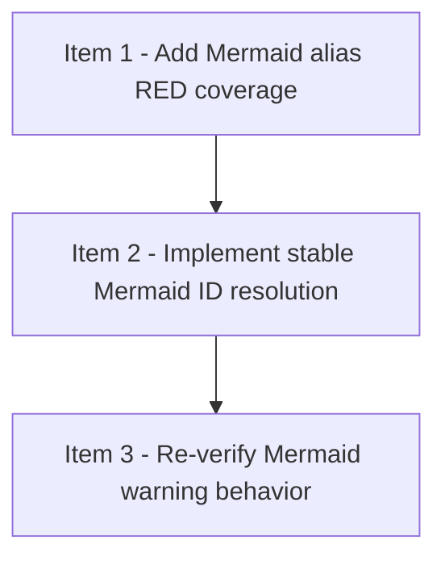

# Viewer Mermaid Validation

## 模式
- 强审开发模式（DAG-first）

## 审核设置
- 审核模型目标：gpt-5.4
- 推理强度目标：xhigh
- 实施并行上限：4
- reviewer 并发上限：2
- 首次等待窗口：5min
- 二次探测窗口：5-10min
- 硬超时门槛：15min

## 当前执行状态
- 当前状态：全部完成
- 当前阻塞原因：无
- 当前调度摘要：item-1 / item-2 / item-3 done
- 当前可执行动作摘要：无

## Checklist
- [x] 1. Add Mermaid alias RED coverage
- [x] 2. Implement stable Mermaid ID resolution
- [x] 3. Re-verify Mermaid warning behavior

## DAG 概览
- 关键串行路径：Item 1 -> Item 2 -> Item 3
- 依赖分层摘要：Wave 1 先补 Mermaid alias -> item_id 解析的 RED 覆盖；Wave 2 实现稳定 Mermaid ID 解析；Wave 3 基于真实 progress checklist 回归 warning 行为
- 可并行批次：Wave 1 = Item 1；Wave 2 = Item 2；Wave 3 = Item 3

## Mermaid DAG

## Ready 队列
- 无

## Active 实现队列
- 无

## Implemented 队列
- 无

## Active reviewer 队列
- 无

## Review Queue
- 无

## Item 1 - Add Mermaid alias RED coverage
### 结构化字段
- item_id：item-1
- blocked_by：[]
- blocks：[item-2]
- shared_surfaces：[viewer-test-contract]
- parallel_group：wave-1
- dispatch_status：done
- assigned_subagent：agent-impl-mermaid-item-1
- reviewer_id：reviewer-mermaid-item-1
- reviewer_state：closed
- 当前状态：RED 覆盖与复审均已完成
- 阻塞原因：无
- next_action：无；item-2 已完成

### 计划
- 目标：先为 Mermaid alias / label / reference 向稳定 item_id 解析的行为补 RED 测试；真实 `docs/checklists/strict-review-progress-viewer.md` 回归是必须覆盖的核心 RED 场景，用来锁定当前 warning 产生路径
- 文件：`strict-review-development-mode/viewer/tests/test_snapshot.py`
- 依赖：无；完成后解锁 item-2
- shared_surfaces：`viewer-test-contract`
- parallel_group：`wave-1`
- 验证：`python3 -m unittest discover -s "strict-review-development-mode/viewer/tests" -p "test_snapshot.py" -v`
- 风险与边界：只写 failing tests，不改 `snapshot.py`；要覆盖 alias/label 混用和真实 progress checklist 回归这两个 RED 场景，且都不能被当成可选补充项

### 实施记录
- 2026-04-07：在 `strict-review-development-mode/viewer/tests/test_snapshot.py` 新增 3 个 Mermaid alias -> item_id RED 测试；其中真实 `docs/checklists/strict-review-progress-viewer.md` 回归是 RED coverage 的一部分，和唯一标题映射、无法稳定映射时仍保留 warning 的负例一起锁定当前 warning 产生路径。

### 验证记录
- 2026-04-07：`python3 -m unittest discover -s "strict-review-development-mode/viewer/tests" -p "test_snapshot.py" -v` -> `FAILED (failures=2)`；新增 alias/label 映射测试 `test_accepts_alias_node_labels_that_match_unique_item_headings` 与 `test_accepts_alias_node_labels_in_real_progress_checklist_regression` 均因仍报出 `mermaid_validation_unavailable` 而失败，确认当前实现只识别 Mermaid 中的原始 `item-*` 标识符，RED 命中预期 gap。

### 审核记录
- Reviewer：reviewer-mermaid-item-1
- Reviewer 状态：closed
- 开始时间：2026-04-07
- 累计等待时长：0min
- 超时次数：0
- 审核轮次：1
- 审核结论：PASS；RED tests 精确锁定 alias-label 与真实 progress checklist 的 warning gap，负例也保留 fail-closed 诊断
- Replacement Reviewer：none
- 关闭状态：closed
- 关闭原因：item-1 完成

## Item 2 - Implement stable Mermaid ID resolution
### 结构化字段
- item_id：item-2
- blocked_by：[item-1]
- blocks：[item-3]
- shared_surfaces：[viewer-snapshot-contract]
- parallel_group：wave-2
- dispatch_status：done
- assigned_subagent：agent-impl-mermaid-item-2
- reviewer_id：reviewer-mermaid-item-2
- reviewer_state：closed
- 当前状态：stable Mermaid ID 实现与复审均已完成
- 阻塞原因：无
- next_action：无；item-3 已可收口

### 计划
- 目标：在 snapshot 合约里加入稳定的 Mermaid ID 解析与 warning 判定，确保 alias / label / item_id 混合引用能被正确归一化
- 文件：`strict-review-development-mode/viewer/snapshot.py`
- 依赖：`blocked_by = [item-1]`
- shared_surfaces：`viewer-snapshot-contract`
- parallel_group：`wave-2`
- 验证：`python3 -m unittest discover -s "strict-review-development-mode/viewer/tests" -p "test_snapshot.py" -v`
- 风险与边界：不能放宽到误吞真实 warning；要保留无法解析时的 `mermaid_validation_unavailable` 语义，但减少稳定 ID 可解析时的误报

### 实施记录
- 2026-04-07：编辑 `strict-review-development-mode/viewer/snapshot.py`，新增 Mermaid alias node 解析与稳定 label -> item_id 归一化逻辑，支持从唯一 item heading/title 反查别名节点，保留 raw `item-*` 引用优先级，并在映射缺失、歧义或 alias 未定义时继续返回不可校验状态。
- 2026-04-07：根据 reviewer 反馈补齐 mixed raw `item-*` + alias-labeled Mermaid graph 归一化缺口；最小化调整 `strict-review-development-mode/viewer/snapshot.py` 的 Mermaid 可校验判定，改为依赖归一化后的 `referenced_item_ids` 集合，不再要求 raw `item-*` 引用单独覆盖全部 items，因此 `item-1 --> B[Item 2 - ...]` 这类混合图在 alias 可稳定解析时可通过校验，而歧义/无关 label 仍保持 warning。
- 2026-04-07：同步更新 `strict-review-development-mode/viewer/tests/fixtures/sample_checklist.md` 的 Mermaid 文本为非稳定别名标签，保留 sample fixture 的负向 fallback 语义，避免既有 sample contract 被新稳定映射路径意外吞掉 warning。
- 2026-04-07：根据本轮 review feedback 在 `strict-review-development-mode/viewer/tests/test_snapshot.py` 补充 title-only alias 歧义回归 `test_keeps_mermaid_validation_warning_when_title_only_alias_labels_are_ambiguous`，锁定 duplicate/ambiguous Mermaid alias label 仍需 fail closed 为 `mermaid_validation_unavailable` 的行为。

### 验证记录
- 2026-04-07：`python3 -m unittest discover -s "strict-review-development-mode/viewer/tests" -p "test_snapshot.py" -v` -> `FAILED (failures=1)`；新增 mixed-reference 回归 `test_accepts_mixed_raw_item_ids_and_alias_node_labels_when_aliases_resolve_stably` 在 `item-1 --> B[Item 2 - Stable target item]` 场景下仍触发 `mermaid_validation_unavailable`，确认 reviewer 指出的 raw `item-*` + alias-labeled Mermaid graph gap 仍存在，RED 命中预期缺口。
- 2026-04-07：`python3 -m unittest discover -s "strict-review-development-mode/viewer/tests" -p "test_snapshot.py" -v` -> `OK (Ran 11 tests in 0.003s)`；新增 mixed-reference 回归、既有 alias heading 回归、title-only alias ambiguity regression、真实 `docs/checklists/strict-review-progress-viewer.md` 回归与负例 `test_keeps_mermaid_validation_warning_when_alias_labels_do_not_stably_map` 同时通过，说明 mixed raw + alias graph 已可稳定归一化，且歧义/无关 labels 仍保留 warning。

### 审核记录
- Reviewer：reviewer-mermaid-item-2
- Reviewer 状态：closed
- 开始时间：2026-04-07
- 累计等待时长：0min
- 超时次数：0
- 审核轮次：1
- 审核结论：PASS；mixed raw+alias 归一化、ambiguity fail-closed 与真实 checklist 回归均通过，bookkeeping 一致
- Replacement Reviewer：none
- 关闭状态：closed
- 关闭原因：item-2 完成
- review note：2026-04-07 根据 reviewer 验证反馈补充 mixed raw `item-*` + alias-labeled Mermaid graph 回归与最小修复；当前保持 item-2 in-review，item-1 同步处于 round-1 open review。

## Item 3 - Re-verify Mermaid warning behavior
### 结构化字段
- item_id：item-3
- blocked_by：[item-2]
- blocks：[]
- shared_surfaces：[viewer-mermaid-validation]
- parallel_group：wave-3
- dispatch_status：done
- assigned_subagent：agent-impl-mermaid-item-3
- reviewer_id：reviewer-mermaid-item-3
- reviewer_state：closed
- 当前状态：真实 warning 回归与复审均已完成
- 阻塞原因：无
- next_action：无

### 计划
- 目标：重新验证 Mermaid warning 行为，确认 stable ID 解析后 `mermaid_validation_unavailable` 不再被错误触发，并在真实 progress checklist 上完成回归检查
- 文件：`docs/checklists/viewer-mermaid-validation.md`、`strict-review-development-mode/viewer/tests/test_snapshot.py`、`docs/checklists/strict-review-progress-viewer.md`
- 依赖：`blocked_by = [item-2]`
- shared_surfaces：`viewer-mermaid-validation`
- parallel_group：`wave-3`
- 验证：`python3 -m unittest discover -s "strict-review-development-mode/viewer/tests" -p "test_snapshot.py" -v`；并对 `docs/checklists/strict-review-progress-viewer.md` 的 snapshot 警告输出做真实回归检查
- 风险与边界：验证必须覆盖真实 checklist 文档，不只看单元测试；要确认 warning 的消失是由稳定 ID 解析带来的，而不是误删诊断信息

### 实施记录
- 2026-04-07：在 `/usr/local/src/project/skills/.worktrees/viewer-idle-timeout` 中复跑 `python3 -m unittest discover -s "strict-review-development-mode/viewer/tests" -p "test_snapshot.py" -v`，确认 stable Mermaid ID 解析落地后，包含真实 progress checklist 回归在内的 9 个 snapshot tests 全部通过。
- 2026-04-07：执行内联 Python 校验，直接导入 `strict-review-development-mode/viewer/parser.py` 与 `strict-review-development-mode/viewer/snapshot.py`，对 `docs/checklists/strict-review-progress-viewer.md` 构建 snapshot；结果显示 warning 列表为空，`mermaid_validation_unavailable` 未出现，且 `dag_degraded=false`、`done_count=5`、implemented/review_queued/in_review 队列均为空，说明 warning 消失来自稳定 ID 解析而非整体诊断退化。

### 验证记录
- 2026-04-07：`python3 -m unittest discover -s "strict-review-development-mode/viewer/tests" -p "test_snapshot.py" -v` -> `OK (Ran 9 tests in 0.003s)`；`test_accepts_alias_node_labels_in_real_progress_checklist_regression`、`test_accepts_alias_node_labels_that_match_unique_item_headings` 与负例 `test_keeps_mermaid_validation_warning_when_alias_labels_do_not_stably_map` 同时通过，说明真实 checklist 已不再误报 warning，且无法稳定映射时仍保留诊断。
- 2026-04-07：`python3 - <<'PY' ... PY`（导入 parser + snapshot，读取 `docs/checklists/strict-review-progress-viewer.md` 并打印 JSON 结果）-> `{"dag_degraded": false, "done_count": 5, "implemented_queue_ids": [], "in_review_ids": [], "mermaid_validation_unavailable_present": false, "review_queued_ids": [], "warning_codes": [], "warning_count": 0}`；确认真实 progress checklist 的 snapshot warning 为空，`mermaid_validation_unavailable` 缺失且其他 warning 行为保持合理。

### 审核记录
- Reviewer：reviewer-mermaid-item-3
- Reviewer 状态：closed
- 开始时间：2026-04-07
- 累计等待时长：0min
- 超时次数：0
- 审核轮次：1
- 审核结论：PASS；真实 `strict-review-progress-viewer.md` 已不再出现 `mermaid_validation_unavailable`，warning 行为回归正常
- Replacement Reviewer：none
- 关闭状态：closed
- 关闭原因：item-3 完成
