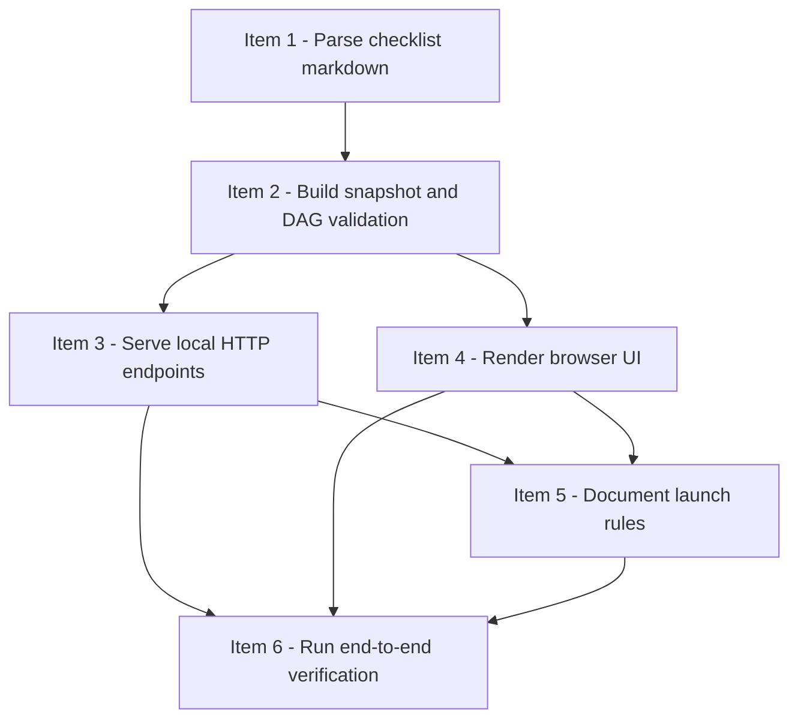

# Strict Review Progress Viewer Implementation Plan

> **For agentic workers:** REQUIRED: Use superpowers:subagent-driven-development (if subagents available) or superpowers:executing-plans to implement this plan. Steps use checkbox (`- [ ]`) syntax for tracking.

**Goal:** Build an on-demand, local, read-only web viewer for `strict-review-development-mode` checklists so users can inspect DAG state, queues, reviewer status, and item details without changing the checklist-driven source of truth.

**Architecture:** Keep the viewer split into four responsibilities: markdown parsing, derived snapshot building, local HTTP serving, and static browser rendering. The browser should only consume `/snapshot` JSON, while all scheduling truth continues to live in the checklist markdown; the server keeps a last-good snapshot so polling during partial writes degrades gracefully instead of blanking the page.

**Tech Stack:** Python 3 standard library (`argparse`, `pathlib`, `json`, `http.server`, `tempfile`, `threading`, `urllib`), HTML, CSS, vanilla JavaScript, Markdown, `unittest`.

**Git note:** Do not create commits unless the user explicitly asks for them. This plan stops at verified local changes.

---

## File Map

**Create:**
- `docs/checklists/strict-review-progress-viewer.md` — strict-review execution checklist for implementing this feature under DAG-first rules
- `docs/superpowers/plans/2026-04-03-strict-review-progress-viewer.md` — this plan file
- `strict-review-development-mode/viewer/parser.py` — parse strict-review checklist markdown into normalized sections and item records
- `strict-review-development-mode/viewer/snapshot.py` — derive counts, queues, DAG edges, warnings, and degraded-mode metadata from parsed checklist data
- `strict-review-development-mode/viewer/serve.py` — local loopback HTTP server, last-good snapshot cache, static file serving, and same-checklist server reuse metadata
- `strict-review-development-mode/viewer/static/index.html` — viewer shell with overview, DAG, queues, warnings, and detail drawer containers
- `strict-review-development-mode/viewer/static/app.js` — polling, rendering, item selection, stale/error banner handling
- `strict-review-development-mode/viewer/static/styles.css` — layout, status colors, drawer styling, warning states
- `strict-review-development-mode/viewer/tests/fixtures/sample_checklist.md` — valid checklist fixture with realistic item states
- `strict-review-development-mode/viewer/tests/fixtures/invalid_cycle_checklist.md` — invalid checklist fixture for cycle/degraded DAG tests
- `strict-review-development-mode/viewer/tests/test_parser.py` — parser unit tests
- `strict-review-development-mode/viewer/tests/test_snapshot.py` — snapshot/validation unit tests
- `strict-review-development-mode/viewer/tests/test_serve.py` — server and last-good snapshot cache tests
- `strict-review-development-mode/viewer/tests/test_frontend_assets.py` — static asset and DOM contract smoke tests
- `strict-review-development-mode/viewer/tests/test_frontend_behavior.py` — browser-behavior tests for rendering, stale/error banners, and selection preservation using `jsdom`-free DOM stubs in Python

**Modify:**
- `strict-review-development-mode/SKILL.md` — document the optional viewer, launch semantics, and read-only boundary
- `README.md` — mention the viewer as a supporting file set inside the skill directory

**Do not modify unless implementation proves it necessary:**
- `strict-review-development-mode/checklist-template.md` — current headings and reviewer fields already satisfy the parser contract; only change if a concrete ambiguity appears during implementation

---

## Strict-Review Checklist Baseline

Before writing code, create `docs/checklists/strict-review-progress-viewer.md` with these checklist items and dependencies:

1. `item-1` — Parse checklist markdown into normalized sections and item records
2. `item-2` — Build derived snapshot, queue, and DAG validation layer
3. `item-3` — Serve `/`, `/health`, and `/snapshot` over a local loopback HTTP server
4. `item-4` — Render the browser UI for overview, DAG, queues, warnings, and item detail drawer
5. `item-5` — Document viewer launch rules in the skill docs and repository README
6. `item-6` — Run end-to-end verification against the sample checklist and record launch instructions

Required DAG:

```text
item-1 -> item-2
item-2 -> item-3
item-2 -> item-4
item-3 -> item-5
item-4 -> item-5
item-3 -> item-6
item-4 -> item-6
item-5 -> item-6
```

Required `shared_surfaces`:
- `item-1`: `viewer-parser`
- `item-2`: `viewer-snapshot-contract`
- `item-3`: `viewer-http-api`
- `item-4`: `viewer-snapshot-contract`, `viewer-ui`
- `item-5`: `viewer-docs`
- `item-6`: `viewer-launch-verification`

Initial `dispatch_status` values:
- `item-1`: `ready`
- `item-2`..`item-6`: `blocked`

---

### Task 1: Create the strict-review checklist baseline

**Files:**
- Create: `docs/checklists/strict-review-progress-viewer.md`
- Reference: `strict-review-development-mode/checklist-template.md`
- Reference: `docs/superpowers/specs/2026-04-03-strict-review-progress-viewer-design.md`

- [ ] **Step 1: Create the checklist document from the template**

Write `docs/checklists/strict-review-progress-viewer.md` with the 6 items listed above. Keep the required top-level sections from the template and populate:

```md
## 当前执行状态
- 当前状态：进行中
- 当前阻塞原因：无
- 当前调度摘要：item-1 ready；其余 blocked
- 当前可执行动作摘要：先完成 item-1 的 parser 与 fixture 计划
```

Also set the item-level DAG fields exactly:

```md
## Item 1 - Parse checklist markdown
### 结构化字段
- item_id：item-1
- blocked_by：[]
- blocks：[item-2]
- shared_surfaces：[viewer-parser]
- parallel_group：wave-1
- dispatch_status：ready
- assigned_subagent：none
```

```md
## Item 2 - Build snapshot and DAG validation
### 结构化字段
- item_id：item-2
- blocked_by：[item-1]
- blocks：[item-3, item-4]
- shared_surfaces：[viewer-snapshot-contract]
- parallel_group：wave-2
- dispatch_status：blocked
- assigned_subagent：none
```

```md
## Item 3 - Serve local HTTP endpoints
### 结构化字段
- item_id：item-3
- blocked_by：[item-2]
- blocks：[item-5, item-6]
- shared_surfaces：[viewer-http-api]
- parallel_group：wave-3a
- dispatch_status：blocked
- assigned_subagent：none
```

```md
## Item 4 - Render browser UI
### 结构化字段
- item_id：item-4
- blocked_by：[item-2]
- blocks：[item-5, item-6]
- shared_surfaces：[viewer-snapshot-contract, viewer-ui]
- parallel_group：wave-3b
- dispatch_status：blocked
- assigned_subagent：none
```

```md
## Item 5 - Document launch rules
### 结构化字段
- item_id：item-5
- blocked_by：[item-3, item-4]
- blocks：[item-6]
- shared_surfaces：[viewer-docs]
- parallel_group：wave-4
- dispatch_status：blocked
- assigned_subagent：none
```

```md
## Item 6 - Run end-to-end verification
### 结构化字段
- item_id：item-6
- blocked_by：[item-3, item-4, item-5]
- blocks：[]
- shared_surfaces：[viewer-launch-verification]
- parallel_group：wave-5
- dispatch_status：blocked
- assigned_subagent：none
```

- [ ] **Step 2: Add the matching Mermaid DAG and queue placeholders**

Use this Mermaid block in the checklist so the human-readable graph matches the structured fields:



Keep `Ready 队列`, `Active 实现队列`, `Active reviewer 队列`, and `Review Queue` present even if they only contain placeholder bullets at this stage.

- [ ] **Step 3: Verify the checklist contains all strict-review-required sections**

Run:

```bash
python3 - <<'PY'
from pathlib import Path
path = Path('docs/checklists/strict-review-progress-viewer.md')
text = path.read_text(encoding='utf-8')
needles = [
    '## Checklist',
    '## DAG 概览',
    '## Mermaid DAG',
    '## Ready 队列',
    '## Active 实现队列',
    '## Active reviewer 队列',
    '## Review Queue',
    '### 结构化字段',
    '### 计划',
    '### 实施记录',
    '### 验证记录',
    '### 审核记录',
    'item_id：item-1',
    'item_id：item-6',
]
for needle in needles:
    assert needle in text, needle
print('strict-review-checklist-ready')
PY
```

Expected: `strict-review-checklist-ready`

- [ ] **Step 4: Stop before implementation until item-level plans are written**

Do not dispatch implementation work before each checklist item’s `### 计划` block is filled with file paths, verification commands, and risks taken from Tasks 2-6 below.

---

### Task 2: Build the parser and fixture contract

**Files:**
- Create: `strict-review-development-mode/viewer/parser.py`
- Create: `strict-review-development-mode/viewer/tests/fixtures/sample_checklist.md`
- Create: `strict-review-development-mode/viewer/tests/test_parser.py`

- [ ] **Step 1: Write the sample fixture and failing parser tests**

Create `sample_checklist.md` with realistic non-placeholder values for:
- one `done` item
- one `implemented` or `review-queued` item
- one `in-review` or `changes-requested` item
- one blocked item with `blocked_by`
- populated reviewer metadata (`Reviewer 状态`, `累计等待时长`, `超时次数`, `Replacement Reviewer`)

Also add parser coverage for:
- duplicate `item_id`
- missing `item_id`
- unknown `dispatch_status`
- a partial checklist missing one or more global sections, which should still parse with warnings instead of raising a hard failure
- the real `strict-review-development-mode/checklist-template.md`, asserting the parser can read the current template shape without crashing, extract the `## Mermaid DAG` block, detect the required global sections, and find structured fields like `item_id`, `blocked_by`, `dispatch_status`, and reviewer metadata headings in the item sections

Then write `test_parser.py` so it asserts the parser can:

```python
parsed = parse_checklist(FIXTURE)
self.assertEqual(parsed['title'], '# Sample Strict Review Checklist')
self.assertIn('审核设置', parsed['global_sections'])
self.assertEqual(parsed['items'][0]['structured']['item_id'], 'item-1')
self.assertEqual(parsed['items'][1]['structured']['blocked_by'], ['item-1'])
self.assertIn('pytest -q', parsed['items'][0]['verification'])
self.assertIn('Reviewer 状态：reviewing', parsed['items'][2]['review'])
```

Also assert that multiline bullets and fenced code blocks inside `### 计划` / `### 验证记录` are preserved as raw section text instead of being flattened away.

- [ ] **Step 2: Run the parser tests to verify they fail first**

Run:

```bash
python3 -m unittest discover -s "strict-review-development-mode/viewer/tests" -p "test_parser.py" -v
```

Expected: FAIL because `parser.py` does not exist yet or `parse_checklist` is missing.

- [ ] **Step 3: Implement the parser with a strict section contract**

Write `parser.py` with a small public surface:

```python
from pathlib import Path

def parse_checklist(path: Path) -> dict:
    ...
```

Implementation requirements:
- read UTF-8 markdown from disk
- capture the document title
- split top-level `##` sections from item sections (`## Item N - ...`)
- recognize the fixed global sections named in the spec and record warnings when any are missing, but do not abort parsing solely because a section is absent
- inside `### 结构化字段`, parse `- key：value` bullets into normalized Python values:
  - `[]` -> `[]`
  - `[item-1, item-2]` -> `['item-1', 'item-2']`
  - other values -> stripped strings
- preserve raw text for `### 计划`, `### 实施记录`, `### 验证记录`, `### 审核记录`
- accumulate parser warnings for missing required headings, duplicate structured keys, malformed bullets, missing `item_id`, or unknown `dispatch_status`

Keep parsing code in one focused file; do not add a generic markdown parser abstraction.

- [ ] **Step 4: Run the parser tests again and make them pass**

Run:

```bash
python3 -m unittest discover -s "strict-review-development-mode/viewer/tests" -p "test_parser.py" -v
```

Expected: PASS for all parser tests.

---

### Task 3: Build derived snapshot, queues, and DAG validation

**Files:**
- Create: `strict-review-development-mode/viewer/snapshot.py`
- Create: `strict-review-development-mode/viewer/tests/fixtures/invalid_cycle_checklist.md`
- Create: `strict-review-development-mode/viewer/tests/test_snapshot.py`
- Reference: `strict-review-development-mode/viewer/parser.py`

- [ ] **Step 1: Write failing snapshot tests for counts, queues, and invalid DAG cases**

In `test_snapshot.py`, cover at least these cases:

```python
snapshot = build_snapshot(parse_checklist(SAMPLE_FIXTURE))
self.assertEqual(snapshot['counts']['done'], 1)
self.assertEqual([item['item_id'] for item in snapshot['queues']['review_queued']], ['item-3'])
self.assertEqual(snapshot['meta']['implementation_concurrency'], 1)
self.assertEqual(snapshot['meta']['reviewer_concurrency'], 1)
```

Also add an invalid fixture that creates a cycle or dangling reference and assert:

```python
snapshot = build_snapshot(parse_checklist(INVALID_FIXTURE))
self.assertTrue(snapshot['meta']['dag_degraded'])
self.assertTrue(any('cycle' in warning['message'].lower() for warning in snapshot['warnings']))
```

Add separate assertions for duplicate/missing `item_id` and unknown `dispatch_status` so the snapshot preserves partial data, surfaces warnings, and still returns queue/count structures.

Finally assert the Mermaid fallback behavior from the spec: if Mermaid nodes lack stable `item_id`s, the snapshot should emit a warning like “无法做精确一致性校验” instead of pretending to do strict graph validation, and must carry the raw Mermaid block through in a field the frontend can render as a collapsed reference panel.

- [ ] **Step 2: Run the snapshot tests to verify they fail first**

Run:

```bash
python3 -m unittest discover -s "strict-review-development-mode/viewer/tests" -p "test_snapshot.py" -v
```

Expected: FAIL because `snapshot.py` does not exist yet.

- [ ] **Step 3: Implement the snapshot builder and validation helpers**

Write `snapshot.py` with a focused public API:

```python
def build_snapshot(parsed: dict) -> dict:
    ...
```

Implementation requirements:
- validate every `blocked_by` / `blocks` reference against known `item_id`s
- warn on asymmetric `blocked_by` / `blocks` pairs rather than silently mutating them
- detect cycles / unlayered nodes with a small topological-sort helper
- build queue arrays from `dispatch_status`, not from the document’s queue sections
- compute `implementation_concurrency` from `active`
- compute `reviewer_concurrency` from `in-review`
- keep `implemented`, `blocked`, and unknown states visible in `counts`, and keep `implemented` in a secondary queue bucket for the UI
- carry the raw Mermaid source or extracted Mermaid section text into the snapshot so the UI can expose it in a collapsed reference panel
- emit `dag_degraded = True` when graph validation fails, but still return nodes, any known edges, item list, and warnings

Recommended shape:

```python
{
    'meta': {
        'checklist_path': '...',
        'dag_degraded': False,
        'implementation_concurrency': 1,
        'reviewer_concurrency': 1,
    },
    'counts': {...},
    'queues': {
        'ready': [...],
        'active': [...],
        'review_queued': [...],
        'in_review': [...],
        'changes_requested': [...],
        'implemented': [...],
        'done': [...],
    },
    'dag': {'nodes': [...], 'edges': [...]},
    'items': [...],
    'warnings': [...],
}
```

- [ ] **Step 4: Run the snapshot tests again and make them pass**

Run:

```bash
python3 -m unittest discover -s "strict-review-development-mode/viewer/tests" -p "test_snapshot.py" -v
```

Expected: PASS for valid and invalid DAG scenarios.

---

### Task 4: Serve the viewer locally with a last-good snapshot cache

**Files:**
- Create: `strict-review-development-mode/viewer/serve.py`
- Create: `strict-review-development-mode/viewer/tests/test_serve.py`
- Reference: `strict-review-development-mode/viewer/parser.py`
- Reference: `strict-review-development-mode/viewer/snapshot.py`

- [ ] **Step 1: Write failing server tests for `/health`, `/snapshot`, and stale fallback behavior**

In `test_serve.py`, cover three things:

```python
self.assertEqual(fetch_json('/health')['ok'], True)
self.assertEqual(fetch_json('/snapshot')['stale'], False)
self.assertIn('counts', fetch_json('/snapshot'))
```

Then add a last-good snapshot cache test using a temporary checklist file:
1. write valid sample checklist
2. refresh once successfully
3. replace file contents with malformed markdown
4. refresh again
5. assert the returned payload still contains the last good snapshot and sets `stale = True`

Also add a first-load failure test where no last-good snapshot exists yet and the checklist path is missing or malformed; assert `/snapshot` still returns a valid JSON error payload instead of an empty response or server exception.

Also add a reuse-path unit test for the metadata helper that maps a checklist path to a state-file path under `tempfile.gettempdir()`.

- [ ] **Step 2: Run the server tests to verify they fail first**

Run:

```bash
python3 -m unittest discover -s "strict-review-development-mode/viewer/tests" -p "test_serve.py" -v
```

Expected: FAIL because `serve.py` does not exist yet.

- [ ] **Step 3: Implement the loopback HTTP server and state-file reuse logic**

Write `serve.py` around a tiny set of responsibilities:
- parse CLI flags: `--checklist`, `--host`, `--port`
- default `host` to `127.0.0.1`
- if `--port 0` is used, let the OS pick a free port and print the actual URL
- compute a deterministic state file for the checklist path under `tempfile.gettempdir()`
- if the state file exists and `/health` responds, print the existing URL and exit instead of starting a duplicate server
- otherwise start a new `ThreadingHTTPServer`
- serve:
  - `/health` -> `{"ok": true}`
  - `/snapshot` -> fresh snapshot JSON or last-good snapshot with `stale: true` and `error`
  - when no last-good snapshot exists yet and parsing fails, still return a valid JSON shell with `stale: true`, an `error` message, empty queue/count structures, and warnings so the frontend can render an error state instead of crashing
  - `/` and `/static/*` -> static asset files

Keep the last-good snapshot cache in-process; do not introduce a database or project-local runtime files.

- [ ] **Step 4: Run the server tests again and make them pass**

Run:

```bash
python3 -m unittest discover -s "strict-review-development-mode/viewer/tests" -p "test_serve.py" -v
```

Expected: PASS for `/health`, `/snapshot`, stale fallback, and reuse helpers.

---

### Task 5: Build the browser UI for overview, DAG, queues, and item details

**Files:**
- Create: `strict-review-development-mode/viewer/static/index.html`
- Create: `strict-review-development-mode/viewer/static/app.js`
- Create: `strict-review-development-mode/viewer/static/styles.css`
- Create: `strict-review-development-mode/viewer/tests/test_frontend_assets.py`
- Create: `strict-review-development-mode/viewer/tests/test_frontend_behavior.py`
- Create: `strict-review-development-mode/viewer/tests/test_browser_runtime.py`

- [ ] **Step 1: Write failing asset, frontend-behavior, and browser-runtime tests**

In `test_frontend_assets.py`, assert the static assets contain the minimum UI contract:

```python
html = Path(INDEX_HTML).read_text(encoding='utf-8')
self.assertIn('id="overview"', html)
self.assertIn('id="dag"', html)
self.assertIn('id="queues"', html)
self.assertIn('id="item-detail"', html)
self.assertIn('id="mermaid-reference"', html)
```

Also assert `app.js` fetches `/snapshot`, renders a stale/error banner, and supports item selection, for example by checking for named functions or DOM hooks such as:

```python
self.assertIn('fetch("/snapshot")', js)
self.assertIn('function renderDag', js)
self.assertIn('function selectItem', js)
self.assertIn('function renderMermaidReference', js)
self.assertIn('stale-banner', html)
```

In `test_frontend_behavior.py`, add Python-driven behavior tests against the JS rendering contract by checking that the source includes explicit handlers/branches for:
- `blocked`, `implemented`, and unknown statuses
- stale/error banner rendering
- selection preservation after refresh
- queue/detail rendering for reviewer timeout fields
- first-load error UI when `/snapshot` returns `stale: true` with empty data

In `test_browser_runtime.py`, write an end-to-end browser/runtime test that starts the local server against `sample_checklist.md`, fetches `/`, loads the page in a real browser runtime if one is available in the environment, and verifies:
- the initial page renders overview counts and queue content from `/snapshot`
- clicking an item updates the detail drawer
- after rewriting the checklist fixture and waiting for the next poll, the rendered counts or queue labels update
- after a refresh with the same `item_id` still present, the selection remains on that item

If no browser automation runtime is available in the environment, make the test explicitly skip with a clear reason rather than silently omitting runtime coverage.

- [ ] **Step 2: Run the asset tests to verify they fail first**

Run:

```bash
python3 -m unittest discover -s "strict-review-development-mode/viewer/tests" -p "test_frontend_*.py" -v
python3 -m unittest discover -s "strict-review-development-mode/viewer/tests" -p "test_browser_runtime.py" -v
```

Expected: FAIL because the static files, frontend behavior hooks, and browser-runtime coverage do not exist yet.

- [ ] **Step 3: Implement the HTML, CSS, and JavaScript UI**

Create:
- `index.html` with semantic containers for:
  - header / checklist path / refresh timestamp
  - warning + stale banner
  - status count cards
  - DAG panel
  - Mermaid 原文折叠参考面板
  - queue columns
  - item detail drawer
- `styles.css` with status classes like `.status-blocked`, `.status-ready`, `.status-active`, `.status-implemented`, `.status-review-queued`, `.status-in-review`, `.status-changes-requested`, `.status-done`, and a fallback class for unknown states
- `app.js` with these responsibilities:
  - poll `/snapshot` every few seconds
  - preserve the selected `item_id` between refreshes when possible
  - render warnings and stale banner text
  - render a first-load error state when `/snapshot` only returns an empty stale shell
  - draw a simple SVG DAG from `snapshot.dag.nodes` / `edges`
  - render the Mermaid reference text from the snapshot in a collapsed panel
  - render queue lists from the derived queue arrays
  - render reviewer timeout/replacement fields in both queue summaries and the detail drawer
  - open/update the item detail drawer on click

Do not add build tooling, npm packages, or client-side mutation endpoints.

- [ ] **Step 4: Run the asset tests again and make them pass**

Run:

```bash
python3 -m unittest discover -s "strict-review-development-mode/viewer/tests" -p "test_frontend_*.py" -v
python3 -m unittest discover -s "strict-review-development-mode/viewer/tests" -p "test_browser_runtime.py" -v
```

Expected: PASS for the static asset, frontend behavior, and browser runtime tests.

---

### Task 6: Document the optional viewer in the skill and repo overview

**Files:**
- Modify: `strict-review-development-mode/SKILL.md`
- Modify: `README.md`
- Reference: `docs/superpowers/specs/2026-04-03-strict-review-progress-viewer-design.md`

- [ ] **Step 1: Add a short viewer section to the skill doc**

Add a focused section to `strict-review-development-mode/SKILL.md` that states:
- the viewer is optional and read-only
- the agent should ask whether the user wants the web interface before launching it
- the checklist markdown remains the single source of truth
- launch command shape:

```bash
python3 strict-review-development-mode/viewer/serve.py --checklist <checklist-path> --port 0
```

Do not turn the viewer into a new control plane; the text should explicitly say that `dispatch_status` and reviewer assignment cannot be edited from the browser.

- [ ] **Step 2: Update the README skill inventory**

Update `README.md` so the `strict-review-development-mode` section mentions the new supporting viewer files and describes them as an optional local progress viewer for DAG / queue inspection.

- [ ] **Step 3: Verify the docs mention the viewer and its read-only boundary**

Run:

```bash
grep -n "viewer\|打开界面\|只读\|single source of truth\|source of truth" \
  strict-review-development-mode/SKILL.md README.md
```

Expected: matches in both files showing launch semantics and read-only wording.

---

### Task 7: Run end-to-end verification and record the launch path

**Files:**
- Modify: `docs/checklists/strict-review-progress-viewer.md`
- Reference: `strict-review-development-mode/viewer/tests/fixtures/sample_checklist.md`

- [ ] **Step 1: Run the full viewer test suite**

Run:

```bash
python3 -m unittest discover -s "strict-review-development-mode/viewer/tests" -p "test_*.py" -v
```

Expected: PASS for parser, snapshot, server, static asset, frontend behavior, and browser runtime tests.

- [ ] **Step 2: Run a syntax check over the Python viewer files**

Run:

```bash
python3 -m py_compile \
  strict-review-development-mode/viewer/parser.py \
  strict-review-development-mode/viewer/snapshot.py \
  strict-review-development-mode/viewer/serve.py
```

Expected: no output.

- [ ] **Step 3: Start the viewer against the sample checklist**

Run:

```bash
python3 strict-review-development-mode/viewer/serve.py \
  --checklist strict-review-development-mode/viewer/tests/fixtures/sample_checklist.md \
  --port 0
```

Expected: prints a loopback URL like `http://127.0.0.1:52341`.

- [ ] **Step 4: Probe the running server and confirm the endpoints**

Run this in a second shell once the server is up, replacing the port if needed:

```bash
python3 - <<'PY'
import json
import urllib.request
base = 'http://127.0.0.1:52341'
for path in ['/health', '/snapshot']:
    with urllib.request.urlopen(base + path) as response:
        payload = json.loads(response.read().decode('utf-8'))
        print(path, sorted(payload.keys())[:5])
PY
```

Expected:
- `/health` includes `ok`
- `/snapshot` includes `meta`, `counts`, `queues`, `dag`, `items`, `warnings`, and `stale`

- [ ] **Step 5: Record verification results back into the strict-review checklist**

Update `docs/checklists/strict-review-progress-viewer.md` so `item-6` contains:
- test suite command + pass result
- `py_compile` result
- sample launch command
- final `next_action` telling future agents to ask the user before opening the viewer on a real checklist

Do not mark the checklist fully done until each prior item has implementation, verification, and review records.

---

## Plan Review Notes

When executing this plan under strong review mode:
- write each checklist item’s `### 计划` block before dispatching it
- once `item-2` is done, dispatch `item-3` and `item-4` in parallel if no new `shared_surfaces` conflict appears
- keep reviewer concurrency at `2` and implementation concurrency at the current reachable cap
- after every item implementation, move through `implemented` -> `review-queued`/`in-review` -> `done` exactly as the strict-review skill requires
