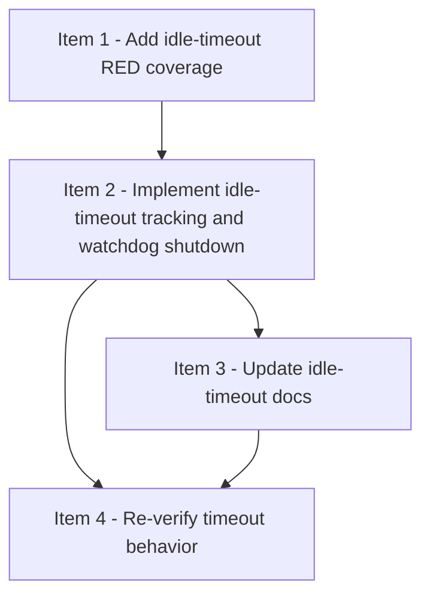

# Viewer Idle Timeout Implementation Plan

> **For agentic workers:** REQUIRED: Use superpowers:subagent-driven-development (if subagents available) or superpowers:executing-plans to implement this plan. Steps use checkbox (`- [ ]`) syntax for tracking.

**Goal:** Add a default 30-minute idle timeout to the strict-review viewer so it auto-exits when nobody is using it, while keeping the existing launch command shape unchanged.

**Architecture:** Keep the feature entirely inside `strict-review-development-mode/viewer/serve.py`. First lock the behavior with RED tests in `test_serve.py`, including default 30-minute / enabled-by-default server settings and unchanged CLI launch coverage, then add local server state for last activity, a guarded watchdog loop, and request-path activity classification that refreshes activity before eligible responses are served. Keep the CLI unchanged for users, but add internal/test-only injection points and one-step watchdog helpers so timeout behavior, keepalive semantics, watchdog exception tolerance, and short-timeout lifecycle proofs can be tested quickly and deterministically.

**Tech Stack:** Python 3 standard library (`threading`, `time`, `argparse`, `http.server`, `socket`, `urllib`, `unittest`, `unittest.mock`), existing viewer server/tests.

---

## File Map

**Modify:**
- `strict-review-development-mode/viewer/serve.py` — add idle activity tracking, watchdog lifecycle helpers, active-path classification, guarded timeout checks, and internal timeout/check-interval injection points
- `strict-review-development-mode/viewer/tests/test_serve.py` — add RED/GREEN coverage for timeout configuration seams, keepalive paths, watchdog shutdown behavior, watchdog exception tolerance, and root-level static alias keepalive
- `strict-review-development-mode/SKILL.md` — tighten viewer docs to say it is launched during task execution and auto-exits after 30 minutes of no page requests
- `README.md` — briefly mention that the optional viewer auto-exits after inactivity

**Create:**
- `docs/checklists/viewer-idle-timeout.md` — strict-review checklist for implementing and verifying the timeout feature
- `docs/superpowers/plans/2026-04-07-viewer-idle-timeout.md` — this plan file

**Reference:**
- `docs/superpowers/specs/2026-04-07-viewer-idle-timeout-design.md`
- `strict-review-development-mode/viewer/serve.py`
- `strict-review-development-mode/viewer/tests/test_serve.py`

---

## Strict-Review Checklist Baseline

Before implementation, create `docs/checklists/viewer-idle-timeout.md` with these items:

1. `item-1` — Add idle-timeout RED coverage
2. `item-2` — Implement idle-timeout tracking and watchdog shutdown
3. `item-3` — Update idle-timeout docs
4. `item-4` — Re-verify timeout behavior

Required DAG:

```text
item-1 -> item-2
item-2 -> item-3
item-2 -> item-4
item-3 -> item-4
```

Required `shared_surfaces`:
- `item-1`: `viewer-test-contract`
- `item-2`: `viewer-http-api`, `viewer-runtime-lifecycle`
- `item-3`: `viewer-docs`
- `item-4`: `viewer-launch-verification`

Initial `dispatch_status` values:
- `item-1`: `ready`
- `item-2`: `blocked`
- `item-3`: `blocked`
- `item-4`: `blocked`

---

### Task 1: Create the timeout checklist baseline

**Files:**
- Create: `docs/checklists/viewer-idle-timeout.md`
- Reference: `docs/superpowers/specs/2026-04-07-viewer-idle-timeout-design.md`

- [ ] **Step 1: Create the checklist document**

Write `docs/checklists/viewer-idle-timeout.md` with the 4 items above, all required top-level sections, and this initial execution summary:

```md
## 当前执行状态
- 当前状态：进行中
- 当前阻塞原因：无
- 当前调度摘要：item-1 ready；item-2 / item-3 / item-4 blocked
- 当前可执行动作摘要：先补 idle timeout / keepalive / watchdog 的 failing tests
```

- [ ] **Step 2: Fill item-1 through item-4 structured fields exactly**

Use these approved fields:

```md
## Item 1 - Add idle-timeout RED coverage
### 结构化字段
- item_id：item-1
- blocked_by：[]
- blocks：[item-2]
- shared_surfaces：[viewer-test-contract]
- parallel_group：wave-1
- dispatch_status：ready
- assigned_subagent：none
```

```md
## Item 2 - Implement idle-timeout tracking and watchdog shutdown
### 结构化字段
- item_id：item-2
- blocked_by：[item-1]
- blocks：[item-3, item-4]
- shared_surfaces：[viewer-http-api, viewer-runtime-lifecycle]
- parallel_group：wave-2
- dispatch_status：blocked
- assigned_subagent：none
```

```md
## Item 3 - Update idle-timeout docs
### 结构化字段
- item_id：item-3
- blocked_by：[item-2]
- blocks：[item-4]
- shared_surfaces：[viewer-docs]
- parallel_group：wave-3
- dispatch_status：blocked
- assigned_subagent：none
```

```md
## Item 4 - Re-verify timeout behavior
### 结构化字段
- item_id：item-4
- blocked_by：[item-2, item-3]
- blocks：[]
- shared_surfaces：[viewer-launch-verification]
- parallel_group：wave-4
- dispatch_status：blocked
- assigned_subagent：none
```

- [ ] **Step 3: Add Mermaid DAG and queue placeholders**

Use this Mermaid block:



- [ ] **Step 4: Verify the checklist is complete before implementation**

Run:

```bash
python3 - <<'PY'
from pathlib import Path
text = Path('docs/checklists/viewer-idle-timeout.md').read_text(encoding='utf-8')
needles = [
    '## Checklist',
    '## DAG 概览',
    '## Mermaid DAG',
    '## Ready 队列',
    '## Active 实现队列',
    '## Active reviewer 队列',
    '## Review Queue',
    'item_id：item-1',
    'item_id：item-4',
]
for needle in needles:
    assert needle in text, needle
print('viewer-idle-timeout-checklist-ready')
PY
```

Expected: `viewer-idle-timeout-checklist-ready`

---

### Task 2: Add RED coverage for timeout and watchdog behavior

**Files:**
- Modify: `strict-review-development-mode/viewer/tests/test_serve.py`
- Reference: `strict-review-development-mode/viewer/serve.py`

- [ ] **Step 1: Add failing tests for timeout configuration seam, default timeout values, and active-path classification**

In `test_serve.py`, add failing tests that prove the server needs internal injection points, keeps the default timeout enabled, and exposes path classification helpers. At minimum, cover:

```python
server = serve_module.create_server(
    checklist_path=SAMPLE_FIXTURE,
    host='0.0.0.0',
    port=0,
    state_dir=Path(self.temp_dir.name),
    idle_timeout_seconds=1.5,
    watchdog_interval_seconds=0.1,
)
self.assertEqual(1.5, server.idle_timeout_seconds)
self.assertEqual(0.1, server.watchdog_interval_seconds)
```

Also add a default-values assertion so the non-injected path stays enabled by default, for example:

```python
default_server = serve_module.create_server(
    checklist_path=SAMPLE_FIXTURE,
    host='0.0.0.0',
    port=0,
    state_dir=Path(self.temp_dir.name),
)
self.assertEqual(1800.0, default_server.idle_timeout_seconds)
self.assertGreater(default_server.watchdog_interval_seconds, 0)
```

And path classification:

```python
self.assertTrue(serve_module.is_activity_path('/'))
self.assertTrue(serve_module.is_activity_path('/snapshot'))
self.assertTrue(serve_module.is_activity_path('/static/app.js'))
self.assertTrue(serve_module.is_activity_path('/app.js'))
self.assertFalse(serve_module.is_activity_path('/health'))
```

- [ ] **Step 2: Add failing tests for watchdog shutdown, keepalive semantics, watchdog exception tolerance, and unchanged CLI defaults**

Add RED tests that use a very short timeout and interval. Cover these behaviors:

1. **Idle shutdown:** no activity requests → server auto-exits within allowed window
2. **Keepalive via `/snapshot`:** repeated `/snapshot` requests keep server alive past the base idle timeout
3. **No keepalive via `/health`:** repeated `/health` requests do not prevent timeout shutdown
4. **Static keepalive:** `/static/app.js` or `/app.js` refreshes activity time
5. **Watchdog exception tolerance:** one watchdog check can raise internally without killing the watchdog forever; a later clean check can still trigger the one-time shutdown path
6. **CLI defaults unchanged:** `parse_args()` / `main()` keep the same user-facing command shape while the created server still gets the default idle-timeout behavior

Keep the timeout window assertion tolerant:

```python
self.assertGreaterEqual(elapsed, idle_timeout)
self.assertLessEqual(elapsed, idle_timeout + watchdog_interval + 0.5)
```

For the watchdog exception case, prefer a deterministic one-step helper such as `_watchdog_check_once()` so the test can force one failure and one later successful shutdown decision without depending on long sleeps.

- [ ] **Step 3: Run the serve test suite to confirm RED**

Run:

```bash
python3 -m unittest discover -s "strict-review-development-mode/viewer/tests" -p "test_serve.py" -v
```

Expected: FAIL because the injection seam, activity-path helper, and watchdog helpers do not exist yet.

---

### Task 3: Implement idle-timeout state and watchdog support

**Files:**
- Modify: `strict-review-development-mode/viewer/serve.py`
- Verify against: `strict-review-development-mode/viewer/tests/test_serve.py`

- [ ] **Step 1: Implement timeout state and activity helpers in `serve.py`**

Add to `ViewerServer`:
- `last_activity_at`
- `idle_timeout_seconds`
- `watchdog_interval_seconds`
- a small lock dedicated to activity updates, or reuse an existing lock only if it remains easy to reason about
- helper method(s) like `mark_activity()` and `seconds_since_last_activity()`

Also add a module-level helper for activity-path classification. It must return true for:
- `/`
- `/snapshot`
- `/static/*`
- current root-level static aliases such as `/app.js` and `/styles.css`

It must return false for `/health`.

- [ ] **Step 2: Implement guarded watchdog helpers, explicit startup wiring, and request-time keepalive ordering**

Add minimal internal helpers, for example:
- `_start_watchdog()` — start one daemon watchdog thread during server setup or immediately before `serve_forever()` ownership begins
- `_watchdog_check_once()` — compute idle duration and decide whether shutdown should be requested
- `_shutdown_for_idle()` — trigger `server.shutdown()` exactly once and guard against duplicate shutdown attempts
- a daemon watchdog loop/thread that periodically calls `_watchdog_check_once()` and sleeps for `watchdog_interval_seconds`

Required behavior:
- eligible requests refresh activity **before** their response is served
- `request refresh observed before timeout wins`
- the watchdog loop wraps each tick in `try/except` so one internal exception does not permanently disable future checks
- the watchdog owns only `shutdown()`; `main()` still owns `server_close()` after `serve_forever()` returns
- timeout state remains internal/test-only; do **not** add new user-facing CLI flags in this pass

If you log the timeout event, keep the message short and aligned with the design doc, e.g. `Viewer idle for 30m, shutting down.`

- [ ] **Step 3: Re-run the serve test suite to get GREEN**

Run the same command again.

Expected: the timeout seam tests, keepalive/idle-shutdown tests, watchdog exception test, and the previously existing serve tests all pass.

---

### Task 4: Update docs to reflect task-time launch and auto-exit

**Files:**
- Modify: `strict-review-development-mode/SKILL.md`
- Modify: `README.md`

- [ ] **Step 1: Update the skill doc wording**

In `strict-review-development-mode/SKILL.md`, keep the current “ask before opening” and “viewer is read-only” language, and add these facts clearly:
- viewer is intended for use during task execution
- it auto-exits after 30 minutes with no page requests
- `/health` does not keep it alive
- the launch command stays unchanged

- [ ] **Step 2: Update README summary text**

In `README.md`, add one concise sentence stating the optional local progress viewer is task-time and auto-exits after 30 minutes of no page requests.

- [ ] **Step 3: Verify the docs mention timeout behavior**

Run:

```bash
grep -n "30 分钟\|30m\|no page requests\|打开界面\|viewer" \
  strict-review-development-mode/SKILL.md README.md
```

Expected: matches in both files.

---

### Task 5: Re-verify actual launch behavior and short-timeout auto-exit

**Files:**
- Modify: `docs/checklists/viewer-idle-timeout.md`

- [ ] **Step 1: Re-run the serve test suite one final time**

Run:

```bash
python3 -m unittest discover -s "strict-review-development-mode/viewer/tests" -p "test_serve.py" -v
```

Expected: all serve tests pass.

- [ ] **Step 2: Do a CLI smoke check with the unchanged launch command in a managed background process**

Start the viewer with the same user-facing command, but run it in a background process or subprocess so the checklist can continue with probes and cleanup:

```bash
python3 strict-review-development-mode/viewer/serve.py \
  --checklist docs/checklists/viewer-idle-timeout.md \
  --port 0
```

Required handling:
- capture the printed URL from stdout
- keep the process alive long enough to probe `/health` and `/snapshot`
- cleanly stop the process after the probes so item-4 does not leave a long-lived viewer behind

Expected: prints a URL in the existing host/port form and serves normally.

- [ ] **Step 3: Probe `/health` and `/snapshot` from the launched server**

Use a small Python probe:

```bash
python3 - <<'PY'
import json
import urllib.request
base = 'http://0.0.0.0:12345'  # replace actual port
for path in ('/health', '/snapshot'):
    with urllib.request.urlopen(base + path) as response:
        payload = json.loads(response.read().decode('utf-8'))
        print(path, response.status, sorted(payload.keys())[:10])
PY
```

Expected:
- `/health` -> `200 ['ok']`
- `/snapshot` -> `200 ['counts', 'dag', 'error', 'items', 'meta', 'queues', 'stale', 'warnings']`

- [ ] **Step 4: Verify live auto-exit with a short injected timeout via Python harness**

Run a short Python harness that imports `serve.py`, creates the server with the normal API plus test-only overrides like `idle_timeout_seconds=1.0` and `watchdog_interval_seconds=0.1`, starts `serve_forever()` in a thread, and confirms the server exits on its own without changing the CLI contract.

Suggested assertions:
- the serve thread is no longer alive after the expected idle window
- observed shutdown time is at least `idle_timeout_seconds`
- observed shutdown time is no more than `idle_timeout_seconds + watchdog_interval_seconds + 0.5`

If the harness probes `/health` during the window, record that it still auto-exits; do not rely on `/health` as keepalive evidence.

- [ ] **Step 5: Record final outcome in the checklist**

Update `docs/checklists/viewer-idle-timeout.md` so item-4 records:
- full serve test suite result
- unchanged launch command used
- actual URL/host form printed
- `/health` and `/snapshot` probe results
- short-timeout live auto-exit verification result and observed timing window
- note that future real usage should still start by asking the user whether to open the viewer

---

## Plan Review Notes

When executing this timeout plan under strong review mode:
- `item-1` owns all RED tests; `item-2` owns the first GREEN implementation that satisfies them
- do not add user-facing timeout CLI flags in this pass
- keep the implementation minimal and local to `serve.py`
- the watchdog loop must survive a per-tick internal exception, and that rule must be covered by tests
- after implementation, the existing host-binding behavior (`0.0.0.0` default) must still work and remain tested
