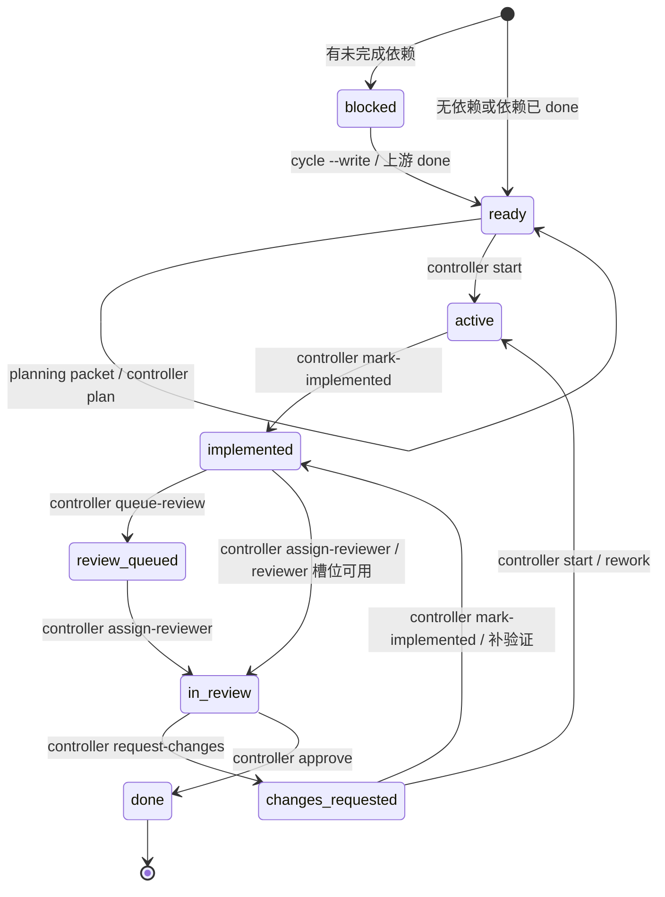

# 强审开发模式

这是 controller-enforced 的开发工作流。`SKILL.md` 只保留执行入口；详细协议放在 `references/protocol.md`，状态转换图放在 `references/workflow-state-machine.md`。

## 不可变规则

1. 先做 `任务归属判定`，结果只允许 `same-task`、`different-task`、`uncertain`。
2. `different-task` 必须新建 checklist；已 `done` 的 checklist 不得 reopened。
3. checklist 是唯一 source of truth，但关键状态字段必须由 `controller.py` 写入。
4. 禁止手改 `dispatch_status`、`assigned_subagent`、`reviewer_id`、`reviewer_state` 和 checklist 勾选状态。
5. 每个 cycle 必须先运行 controller；controller 返回 error 时先修 error，不得继续推进。
6. 有 `dispatch_packets` 时必须消费 packet；能并行就并行派发，不能并行就按 packet 顺序本地执行。
7. 结束前必须再次运行 `cycle`；只有所有 item 都是 `done` 才能宣布完成。
8. 用户只需要和 coordinator 沟通；planner、developer、reviewer 可以是任意 agent，由 coordinator 根据 packet 路由和当前环境决定如何调用。

## 入口流程

1. 判定当前请求属于 `same-task`、`different-task` 还是 `uncertain`。
2. 为 `same-task` 选择既有未完成 checklist；为 `different-task` 新建 checklist。
3. 若任务尚未拆成可并行工作包，先拆成 item-level DAG，并明确 `blocked_by`、`blocks`、`shared_surfaces`。
4. 创建或补齐 checklist 后运行：

```bash
python3 strict-review-development-mode/controller.py validate --checklist <checklist.md> --json
```

5. 每个执行循环都运行：

```bash
python3 strict-review-development-mode/controller.py cycle --checklist <checklist.md> --json
```

6. 如果 `cycle` 输出 `status_updates`，运行：

```bash
python3 strict-review-development-mode/controller.py cycle --checklist <checklist.md> --write --json
```

7. 如果 `cycle` 输出 `dispatch_packets`，coordinator 根据 `target_agent`、`role`、`prompt` 派发工作包，并自行决定调用方式和参数。

## 常用命令

```bash
python3 strict-review-development-mode/controller.py init --checklist <checklist.md> --title "<任务标题>" --request "<用户请求>" --items-json '<json-array>'
python3 strict-review-development-mode/controller.py validate --checklist <checklist.md> --json
python3 strict-review-development-mode/controller.py cycle --checklist <checklist.md> --json
python3 strict-review-development-mode/controller.py diagram
python3 strict-review-development-mode/controller.py plan --checklist <checklist.md> --item item-1 --text-file <plan-file>
python3 strict-review-development-mode/controller.py start --checklist <checklist.md> --item item-1 --agent <agent-id>
python3 strict-review-development-mode/controller.py mark-implemented --checklist <checklist.md> --item item-1 --implementation-file <impl-file> --verification-file <verification-file>
python3 strict-review-development-mode/controller.py queue-review --checklist <checklist.md> --item item-1
python3 strict-review-development-mode/controller.py assign-reviewer --checklist <checklist.md> --item item-1 --reviewer <reviewer-id>
python3 strict-review-development-mode/controller.py request-changes --checklist <checklist.md> --item item-1 --review-file <review-file>
python3 strict-review-development-mode/controller.py approve --checklist <checklist.md> --item item-1 --review-file <approval-file>
```

`items-json` 是工作包数组，每项至少包含 `item_id` 和 `title`，可包含 `blocked_by`、`shared_surfaces`、`parallel_group`。

## Agent 路由策略

checklist 可包含全局路由：

```md
## Agent 路由策略
- coordinator_agent：codex
- default_agent：current
- fallback_agent：current
- planning_agent：codex
- implementation_agent：claude
- rework_agent：claude
- review_agent：gemini
- invocation_policy：coordinator-decides
```

也可以在 item 的 `结构化字段` 中覆盖：

```md
- implementation_agent：claude
- review_agent：gemini
```

优先级为：item 级 agent > 全局角色 agent > `default_agent` > `current`。

agent 名称只作为不透明字符串透传，例如 `codex`、`claude`、`gemini`、`human:alice`、`openai:gpt-5.4`。controller 不生成 model、temperature、CLI 参数、API 参数或认证信息；这些都由 coordinator 决策。

## 状态转换图



## dispatch_packets 语义

`cycle --json` 会按固定优先级输出 packet：

1. `rework` / `replan`：优先处理 reviewer 要求修改的事项。
2. `review`：实现和验证已完成，等待独立审核。
3. `planning`：ready 但尚无具体计划。
4. `implementation`：ready 且计划已写明，可进入实施。

packet 是 C 方案的通用接口。controller 不直接调用任何平台私有 subagent API；Codex、Claude、Gemini、OpenAI、CI worker 或人工 reviewer 都可以消费 packet，再用 controller 命令写回结果。

每个 packet 会包含：

- `role`：`planning`、`implementation`、`rework` 或 `review`
- `target_agent`：建议交给哪个 agent
- `fallback_agent`：目标不可用时的回退
- `routing_source`：路由来自全局策略还是 item 覆盖
- `invocation_policy`：固定为 `coordinator-decides`
- `prompt`：工作包说明
- `command`：结果写回 controller 时的建议命令

## 何时读取参考文档

- 需要完整协议、冲突规则、reviewer 生命周期时，读取 `references/protocol.md`。
- 需要只看状态机和 Mermaid 图时，读取 `references/workflow-state-machine.md`。
- 用户要求打开进度界面时，再看 `viewer/serve.py` 的启动方式；viewer 只读，不参与调度。

## 结束前检查

结束前必须运行：

```bash
python3 strict-review-development-mode/controller.py cycle --checklist <checklist.md> --json
```

如果仍有 error、`status_updates`、`dispatch_packets`、未完成 item、活跃 reviewer 或待处理 reviewer assignment，就继续推进或报告明确 blocker；不要宣布完成。
