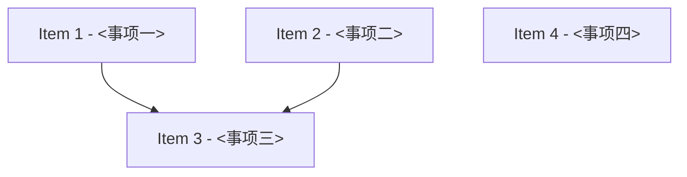

# <任务标题>

## 模式
- 强审开发模式（controller-enforced DAG-first）

## 文档位置
- 专属目录：.strict-review/<task-slug>/
- task_slug：<描述当前强审开发任务解决的问题>
- checklist：.strict-review/<task-slug>/checklist.md
- 派工文档命名：.strict-review/<task-slug>/<item_id>-<kind>.md
- 批量审核文档命名：.strict-review/<task-slug>/<review_group>-review-batch.md
- 约束：强审流程产生的计划、实施、验证、审核等文档只写入上述任务目录

## 审核设置
- 审核模型目标：gpt-5.4
- 推理强度目标：xhigh
- 实施并行上限：不限制
- reviewer 并行上限：不限制
- 并行安全约束：不限制子 agent 数量；实施仍受 DAG 依赖和 shared_surfaces 冲突约束
- 首次等待窗口：10min
- 二次探测窗口：10-20min
- 硬超时门槛：30min

## Agent 路由策略
- coordinator_agent：current
- default_agent：current
- fallback_agent：current
- planning_agent：current
- implementation_agent：current
- rework_agent：current
- review_agent：current
- invocation_policy：coordinator-decides

## 任务归属判定
- 当前请求：<待填写>
- 判定结果：different-task
- 判定依据：默认模板用于当前请求的新 checklist；若确认同任务续做，应改为 same-task 并继续既有 checklist
- 关联旧 checklist：none
- 处理动作：在当前 checklist 记录本次任务进度；不要向无关旧 checklist 追加工作项

## 完成契约
- 用户原始请求范围：<用户要求的完整交付范围>
- 本 checklist 覆盖范围：<本 checklist 覆盖哪些请求内事项>
- 自划阶段是否可作为停止条件：否
- 允许中途停止条件：用户明确要求暂停 / blocker / needs-clarification
- 请求内未纳入事项：待确认
- 后续建议边界：只能写请求外增强项，不能把用户原始要求内的事项放到后续建议

## 任务启动总规划
- 任务目标：<本轮最终要交付什么>
- 非目标：<本轮明确不做什么>
- 验收标准：<什么结果算完成>
- 已知约束：<用户要求、技术边界、兼容性、时间/范围限制>
- 代码侦察证据：<启动前看过的关键文件/模块/命令摘要>
- 初步方案：<采用什么方向解决>
- 工作包拆分理由：<为什么拆成当前 items>
- 并行策略：<哪些可并行，哪些必须串行，依据是什么>
- 主要风险：<数据/接口/权限/并发/测试/兼容性等>
- 需要用户确认的问题：无
- 启动判定：needs-clarification

## 当前执行状态
- 当前状态：进行中
- 当前阻塞原因：无
- 当前调度摘要：初始可达事项为 item-1、item-2、item-4；item-3 仍受依赖阻塞
- 当前可执行动作摘要：先补齐可达事项计划，再按 DAG 与 shared_surfaces 派发实施

## 任务重整摘要
- 原始任务形态：已拆为可并行工作包
- 是否触发任务重整：否
- 重整触发原因：无；原始任务已具备稳定工作包边界
- 工作包映射：item-1、item-2、item-3、item-4
- 并行批次说明：Wave 1 = item-1 + item-2 + item-4；Wave 2 = item-3
- 关键不可并行约束：item-3 依赖 item-1 与 item-2 完成后才能进入 ready

## 交付总结
- 完成状态：pending
- 用户请求内交付内容：待填写
- 用户请求内未交付内容：待完成
- 请求外后续建议：无
- 关键变更位置：待填写
- 最终验证证据：待填写
- 审核结果摘要：待填写
- 遗留风险：待填写
- 用户验收入口：待填写

## Checklist
- [ ] 1. <事项一>
- [ ] 2. <事项二>
- [ ] 3. <事项三>
- [ ] 4. <事项四>

## DAG 概览
- 关键串行路径：Item 1 / Item 2 -> Item 3
- 依赖分层摘要：Wave 1 为可并行实施项，Wave 2 为依赖 Wave 1 的集成项
- 可并行批次：Wave 1 = Item 1 + Item 2 + Item 4；Wave 2 = Item 3

## Mermaid DAG

## Ready 队列
- item-1 — <事项一>
- item-2 — <事项二>
- item-4 — <事项四>

## Active 实现队列
- 无

## Active reviewer 队列
- 无

## Review Queue
- 无

## Item 1 - <事项一>
### 结构化字段
- item_id：item-1
- blocked_by：[]
- blocks：[item-3]
- shared_surfaces：[]
- parallel_group：wave-1
- dispatch_status：ready
- assigned_subagent：none
- reviewer_id：none
- reviewer_state：not-started
- risk_level：medium
- review_mode：single
- review_group：none
- 当前状态：未开始
- 阻塞原因：无
- next_action：补齐计划后进入实施调度

### 计划
- 待填写

### 实施记录
- 待填写

### 验证记录
- 待填写

### 审核记录
- Reviewer：待填写
- Reviewer 状态：待填写
- 开始时间：待填写
- 累计等待时长：待填写
- 超时次数：待填写
- 审核轮次：待填写
- 审核结论：待填写
- Replacement Reviewer：待填写
- 关闭状态：待填写
- 关闭原因：待填写

## Item 2 - <事项二>
### 结构化字段
- item_id：item-2
- blocked_by：[]
- blocks：[item-3]
- shared_surfaces：[]
- parallel_group：wave-1
- dispatch_status：ready
- assigned_subagent：none
- reviewer_id：none
- reviewer_state：not-started
- risk_level：medium
- review_mode：single
- review_group：none
- 当前状态：未开始
- 阻塞原因：无
- next_action：补齐计划后进入实施调度

### 计划
- 待填写

### 实施记录
- 待填写

### 验证记录
- 待填写

### 审核记录
- Reviewer：待填写
- Reviewer 状态：待填写
- 开始时间：待填写
- 累计等待时长：待填写
- 超时次数：待填写
- 审核轮次：待填写
- 审核结论：待填写
- Replacement Reviewer：待填写
- 关闭状态：待填写
- 关闭原因：待填写

## Item 3 - <事项三>
### 结构化字段
- item_id：item-3
- blocked_by：[item-1, item-2]
- blocks：[]
- shared_surfaces：[]
- parallel_group：wave-2
- dispatch_status：blocked
- assigned_subagent：none
- reviewer_id：none
- reviewer_state：not-started
- risk_level：medium
- review_mode：single
- review_group：none
- 当前状态：未开始
- 阻塞原因：等待 item-1 与 item-2 进入 done
- next_action：等待上游依赖完成后重算 dispatch_status

### 计划
- 待填写

### 实施记录
- 待填写

### 验证记录
- 待填写

### 审核记录
- Reviewer：待填写
- Reviewer 状态：待填写
- 开始时间：待填写
- 累计等待时长：待填写
- 超时次数：待填写
- 审核轮次：待填写
- 审核结论：待填写
- Replacement Reviewer：待填写
- 关闭状态：待填写
- 关闭原因：待填写

## Item 4 - <事项四>
### 结构化字段
- item_id：item-4
- blocked_by：[]
- blocks：[]
- shared_surfaces：[]
- parallel_group：wave-1
- dispatch_status：ready
- assigned_subagent：none
- reviewer_id：none
- reviewer_state：not-started
- risk_level：medium
- review_mode：single
- review_group：none
- 当前状态：未开始
- 阻塞原因：无
- next_action：补齐计划后进入实施调度

### 计划
- 待填写

### 实施记录
- 待填写

### 验证记录
- 待填写

### 审核记录
- Reviewer：待填写
- Reviewer 状态：待填写
- 开始时间：待填写
- 累计等待时长：待填写
- 超时次数：待填写
- 审核轮次：待填写
- 审核结论：待填写
- Replacement Reviewer：待填写
- 关闭状态：待填写
- 关闭原因：待填写
