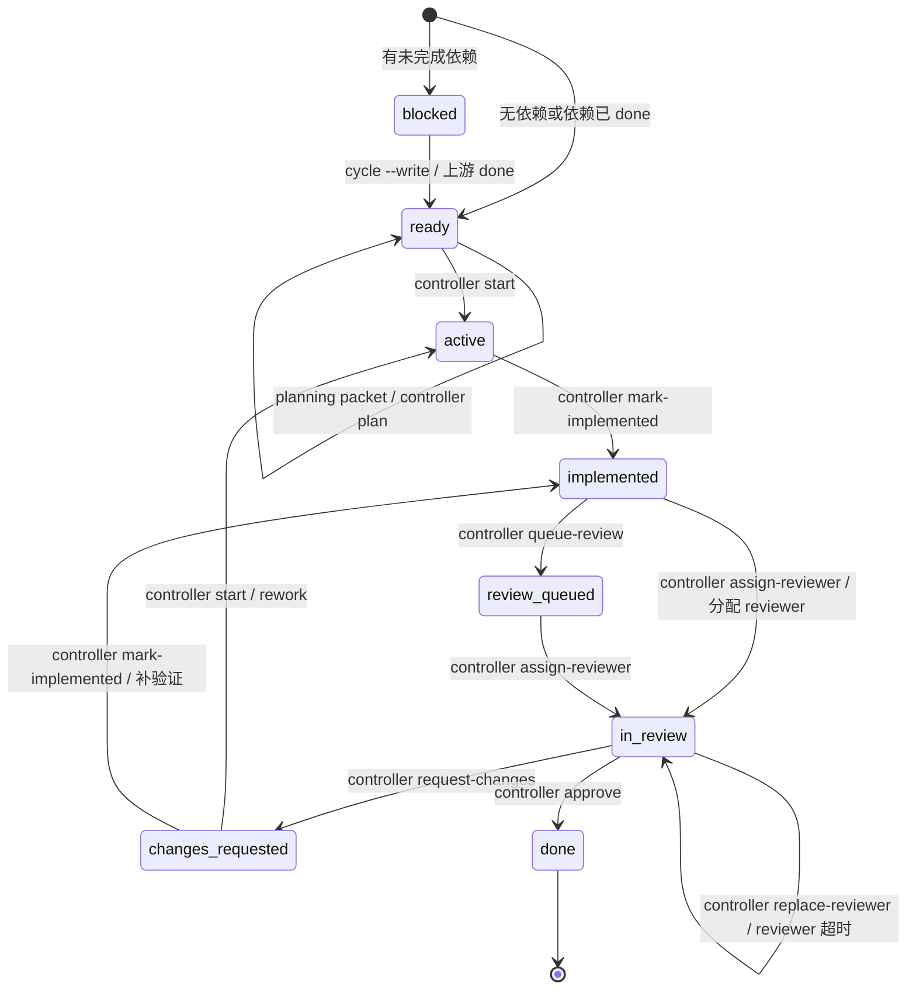
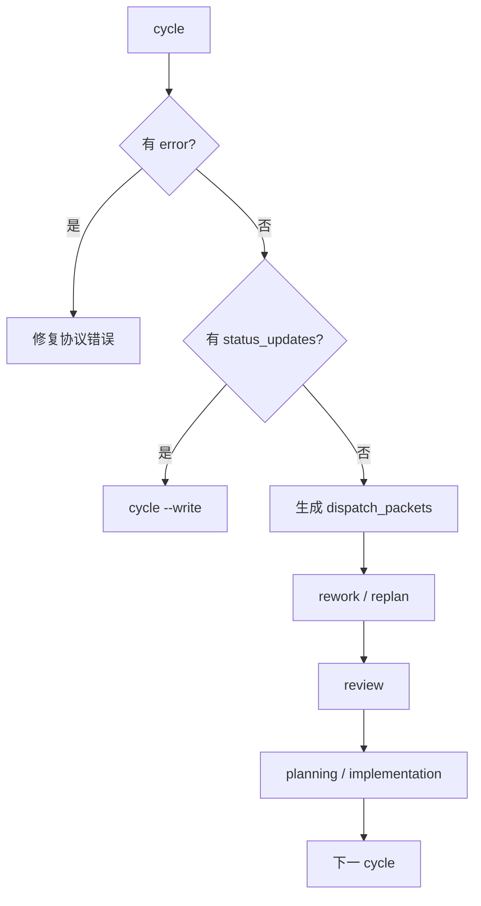

# 工作流状态转换图

这张图描述 `dispatch_status` 的合法主路径。实际迁移必须由 `controller.py` 命令执行。

## 状态含义

- `blocked`：依赖未完成，或当前 cycle 与活跃事项存在不可并行冲突。
- `ready`：依赖已满足；如果计划缺失，下一步是 `planning` packet；如果计划已写明，下一步是 `implementation` packet。
- `active`：事项正在实施，尚未完成实施和验证闭环。
- `implemented`：实施和验证已记录，等待审核调度。
- `review-queued`：等待分配 reviewer。
- `in-review`：独立 reviewer 正在审核。
- `changes-requested`：reviewer 要求修改，下一 cycle 优先处理。
- `done`：最新审核通过，reviewer 已关闭。

## 调度优先级

