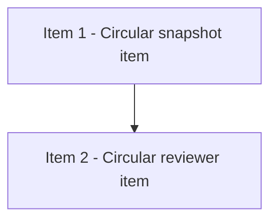

# Invalid Cycle Checklist

## 模式
- 强审开发模式（DAG-first）

## 审核设置
- 审核模型目标：gpt-5.4
- 推理强度目标：xhigh
- 实施并发上限：4
- reviewer 并发上限：2

## 当前执行状态
- 当前状态：进行中
- 当前阻塞原因：依赖图无效
- 当前调度摘要：item-1 与 item-2 形成 cycle，且存在 dangling reference
- 当前可执行动作摘要：修复结构化字段中的依赖关系

## Checklist
- [ ] 1. Break invalid dependency cycle
- [ ] 2. Repair dangling reference

## DAG 概览
- 关键串行路径：无；当前 DAG 无效
- 依赖分层摘要：无法可靠分层
- 可并行批次：待修复后再计算

## Mermaid DAG

## Ready 队列
- item-2 — Circular reviewer item

## Active 实现队列
- item-1 — Circular snapshot item

## Active reviewer 队列
- 无

## Review Queue
- 无

## Item 1 - Circular snapshot item
### 结构化字段
- item_id：item-1
- blocked_by：[item-2]
- blocks：[item-missing]
- shared_surfaces：[viewer-snapshot-contract]
- parallel_group：wave-invalid
- dispatch_status：active
- assigned_subagent：agent-impl-item-1
- reviewer_id：none
- reviewer_state：not-started
- next_action：移除无效依赖

### 计划
- 修复 item-1 的 dependency metadata。

### 实施记录
- 暂未修复。

### 验证记录
- 待填写。

### 审核记录
- Reviewer：待填写
- Reviewer 状态：待填写

## Item 2 - Circular reviewer item
### 结构化字段
- item_id：item-2
- blocked_by：[item-1]
- blocks：[]
- shared_surfaces：[viewer-review]
- parallel_group：wave-invalid
- dispatch_status：ready
- assigned_subagent：none
- reviewer_id：none
- reviewer_state：not-started
- next_action：等待 DAG 修复

### 计划
- 修复 item-2 的 dependency metadata。

### 实施记录
- 暂未修复。

### 验证记录
- 待填写。

### 审核记录
- Reviewer：待填写
- Reviewer 状态：待填写
