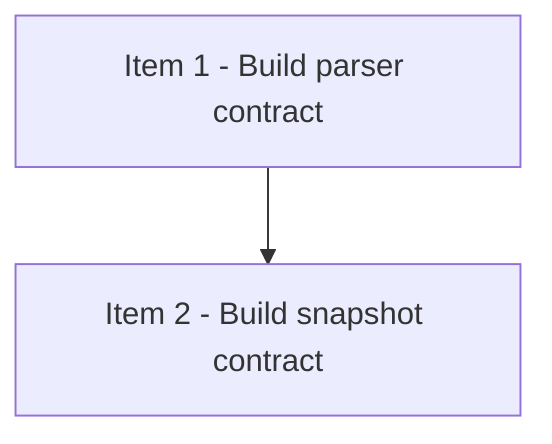

# Strict Review Progress Viewer

## 模式
- 强审开发模式（DAG-first）

## 审核设置
- 审核模型目标：gpt-5.4
- 推理强度目标：xhigh
- 实施并行上限：4
- reviewer 并行上限：2
- 首次等待窗口：5min
- 二次探测窗口：5-10min
- 硬超时门槛：15min

## 当前执行状态
- 当前状态：进行中
- 当前阻塞原因：无
- 当前调度摘要：item-1 in-review；item-2 ready
- 当前可执行动作摘要：等待 item-1 reviewer 结果，期间保持 item-2 ready

## Checklist
- [ ] 1. Build parser contract
- [ ] 2. Build snapshot contract

## DAG 概览
- 关键串行路径：Item 1 -> Item 2
- 依赖分层摘要：Wave 1 = parser；Wave 2 = snapshot
- 可并行批次：Wave 1 = Item 1；Wave 2 = Item 2

## Mermaid DAG


## Ready 队列
- item-2 — Build snapshot contract

## Active 实现队列
- 无

## Active reviewer 队列
- item-1 — reviewer-parser-item-1（slow）

## Review Queue
- 无

## Item 1 - Build parser contract
### 结构化字段
- item_id：item-1
- blocked_by：[]
- blocks：[item-2]
- shared_surfaces：[viewer-parser]
- parallel_group：wave-1
- dispatch_status：in-review
- assigned_subagent：agent-impl-item-1
- reviewer_id：reviewer-parser-item-1
- reviewer_state：slow
- next_action：等待 reviewer 完成 parser 复审

### 计划
- 固化 parser 输出契约，供 snapshot 层直接消费。
- 处理多段原始 markdown，必须保留代码块与换行。
  继续保留这一行，证明多行 bullet 内容没有丢失。
- 验证命令：
  ```bash
  python3 -m unittest discover -s "strict-review-development-mode/viewer/tests" -p "test_parser.py" -v
  ```

### 实施记录
- 新增 parser contract 测试夹具。
- 明确 `dispatch_status` 必须保留原始字符串，未知值交给 warning 处理。

### 验证记录
- 2026-04-03：运行 parser 单测，验证 UTF-8 fixture 可读。
- 2026-04-03：确认 multiline bullet 与 code fence 在原始 section 文本中完整保留。

### 审核记录
- Reviewer：reviewer-parser-item-1
- Reviewer 状态：slow
- 开始时间：2026-04-03 10:05
- 累计等待时长：6min
- 超时次数：1
- 审核轮次：1
- 审核结论：等待 reviewer 返回
- Replacement Reviewer：none
- 关闭状态：open
- 关闭原因：无

## Item 2 - Build snapshot contract
### 结构化字段
- item_id：item-2
- blocked_by：[item-1]
- blocks：[]
- shared_surfaces：[viewer-snapshot-contract, viewer-ui]
- parallel_group：wave-2
- dispatch_status：ready
- assigned_subagent：none
- reviewer_id：none
- reviewer_state：not-started
- next_action：等待 item-1 done 后启动 snapshot TDD

### 计划
- 基于 parser 输出构建 counts、queues 与 DAG 快照。

### 实施记录
- 待填写

### 验证记录
- 待填写

### 审核记录
- Reviewer：待填写
- Reviewer 状态：待填写
- 开始时间：待填写
- 累计等待时长：待填写
- 超时次数：待填写
- 审核轮次：待填写
- 审核结论：待填写
- Replacement Reviewer：待填写
- 关闭状态：待填写
- 关闭原因：待填写
